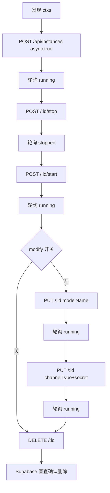

# Agent Manager 集成测试

> 基于 **Vitest + 原生 fetch** 的 API 级集成测试，对**已部署**的 Agent Manager 后端 `/api/*` 做黑盒回归。
> 同时通过 `service_role` Supabase 客户端做数据库侧强断言与清理。

---

## 1. 是什么 / 不是什么

| ✅ 覆盖 | ❌ 不覆盖 |
|---|---|
| 被测后端 `/api/*` 的业务主流程（用户管理、实例生命周期） | 前端 UI 行为（见 `tests/ui/` 下的 Playwright 用例） |
| RBAC 管理员路径 / 普通用户路径对照 | 真实 AI 模型推理、Token 计量压测 |
| E2B 沙箱实例的 create → stop → start → modify → delete 全链路 | 混沌 / 性能 / 安全专项测试 |
| Supabase 数据库侧资源是否按预期写入 / 删除 | 本地启动后端服务 |

测试以"外部消费者"视角直接调 HTTP API，不依赖内部代码路径，所以**后端必须先部署可达**。

---

## 2. 目录结构

```
tests/integration/
├── vitest.config.js            # 独立配置：globalSetup / setupFiles / 串行 / JUnit
├── setup/
│   ├── global-setup.js         # 进程级：拨测 /api/health + 确保测试管理员存在（幂等）
│   └── test-env.js             # 每个 worker 加载 .env.test，导出 testEnv / entityPrefix
├── helpers/
│   ├── api-client.js           # fetch 封装：注入 Bearer、统一错误、支持 per-request 超时
│   ├── auth.js                 # 登录管理员 / 创建临时普通用户（直连 / 通过后端 /api/users）
│   ├── supabase.js             # service_role 客户端 + 按前缀批量清理
│   ├── factory.js              # 命名工厂：it-<runId>-<suffix>，保障清理可定位
│   └── wait-for.js             # 通用轮询，直到条件满足或超时
├── fixtures/                   # 共享 JSON 夹具
└── suites/
    ├── smoke/                  # 最小可用性：/api/health、鉴权拒绝 / 放行
    ├── user-management/        # 用户 CRUD、批量导入、RBAC、status 切换
    ├── instance-lifecycle/     # 内置 agent-type 的只读 + 完整生命周期
    │   ├── _shared.js                        # 发现 ctxs + runLifecycle 公共实现
    │   ├── instance-read.test.js             # list / detail / overview 只读
    │   ├── instance-create.test.js           # 管理员路径，对每个内置 agent-type 跑完链路
    │   └── instance-create-as-user.test.js   # 普通用户路径（RBAC 对照）
    └── sandbox-upgrade/        # Sandbox 升级 API 合约 + 可选集群/FVT 校验
        ├── sandbox-upgrade-api.test.js
        └── sandbox-upgrade-retention.test.js
```

---

## 3. 详细使用步骤

### 3.1 前置条件

1. 目标环境的后端可访问：`GET <TEST_BASE_URL>/api/health` 返回 200。
2. 测试用 Supabase 项目：
   - 已跑完 `agent-manager/migrations/` 下的 SQL；
   - 拥有 `service_role` key（**不能**是生产 key）；
   - 若被测后端连接的就是同一个 Supabase，请评估批量清理影响（测试会按 `it-<runId>-` 前缀删除实体）。
3. Node 18+ / npm 9+（`fetch`、`AbortSignal.timeout` 依赖原生支持）。

### 3.2 初始化环境变量

本地运行与 CI 使用两份分离的环境文件：

| 场景 | 加载的文件 | 是否入库 | 说明 |
|---|---|---|---|
| 本地 | `.env.test` | ❌（已 gitignore） | 开发者各自填自己的测试环境连接信息 |
| CI 流水线（`CI=true`） | `.env.test.pre` | ✅ 入库 | 流水线统一使用的测试环境基线 |
| 显式指定 | `TEST_ENV_FILE=/abs/path` | — | 自动覆盖上面的默认选择 |

> 加载优先级（`setup/test-env.js` 实现）：
> 1. `TEST_ENV_FILE` 指定的文件
> 2. `CI=true` → 先 `.env.test.pre`，回退 `.env.test`
> 3. 本地 → 先 `.env.test`，回退 `.env.test.pre`
> 4. `dotenv` 默认不覆盖已有 `process.env`，所以通过 `export` 注入的变量总是最优先

本地初始化：

```bash
cp agent-manager/.env.test.example agent-manager/.env.test
# 按需填写下表的必填项
```

必填（缺一不可，`test-env.js` 会直接抛错）：

| 变量 | 含义 |
|---|---|
| `TEST_BASE_URL` | 被测后端入口，例如 `https://openclaw-staging.example.com` |
| `TEST_VITE_SUPABASE_URL` | 测试用 Supabase 项目 URL |
| `TEST_VITE_SUPABASE_ANON_KEY` | anon key（给登录用） |
| `TEST_SERVICE_ROLE_KEY` | service role key（给清理和 admin 操作用） |
| `TEST_ADMIN_EMAIL` / `TEST_ADMIN_PASSWORD` | 测试管理员账号，首次运行时由 `globalSetup` 自动创建/同步 |

可选（按需覆盖默认值）：

| 变量 | 默认 | 作用 |
|---|---|---|
| `TEST_RUN_ID` | `Date.now().toString(36)` | 稳定化本次运行 id，便于清理/排查；CI 里可注入 commit sha |
| `TEST_REQUEST_TIMEOUT_MS` | `30000` | 通用 HTTP 请求超时 |
| `TEST_INSTANCE_READY_TIMEOUT_MS` | `180000` | 实例 provision 等待 ready 超时 |
| `TEST_INSTANCE_WRITE_TIMEOUT_MS` | `max(ready, 120000)` | `POST/PUT /api/instances` 的单请求超时（同步阶段含 APIG + E2B 创建） |
| `TEST_SKIP_E2B` | `false` | 为 `true` 时跳过需要真实 E2B 的实例创建用例 |
| `TEST_SKIP_INSTANCE_MODIFY` | `false` | 为 `true` 时只跳过实例链路的"改模型 / 改渠道"两步 |
| `TEST_SKIP_SANDBOX_UPGRADE` | `false` | 为 `true` 时跳过 Sandbox 升级集群相关用例 |
| `TEST_SANDBOX_UPGRADE_AGENT_TYPE_ID` | 空 | 可选；配置后固定使用该 Agent Type，否则自动寻找已配置 hooks 的 Agent Type |
| `TEST_SANDBOX_UPGRADE_RETENTION` | CI: `true`；本地: `false` | 为 `true` 时开启破坏性 FVT：创建实例、进 Pod 写入任务产物、发起 SelectedSandboxes 升级、升级后进 Pod 校验产物保留；需要临时跳过全量 CI 时显式置 `false` |
| `TEST_KUBECONFIG` / `KUBECONFIG` | 本地: `~/.kube/config`；CI: `HZ_KUBECONFIG_B64` | 用于通过 Kubernetes API 进入 Sandbox Pod 和 patch SandboxSet；全量 CI 会从仓库 secret `HZ_KUBECONFIG_B64` 解码生成临时 kubeconfig |
| `TEST_SANDBOX_UPGRADE_RETENTION_TIMEOUT_MS` | `900000` | retention FVT 等待 SandboxUpdateOps 完成的超时 |
| `TEST_SANDBOX_UPGRADE_PRE_TASK_COMMAND` | 写入 `~/.openclaw/codex-fvt/*.json` | 升级前在 Pod 内执行的任务命令；可替换为真实聊天/任务命令，命令可读取 `OPENCLAW_FVT_MARKER` 与 `OPENCLAW_FVT_FILE` |
| `TEST_SANDBOX_UPGRADE_POST_VERIFY_COMMAND` | 校验默认产物文件 | 升级后在 Pod 内执行的校验命令；可替换为真实聊天历史/任务结果校验 |
| `TEST_CLEAN_ON_FAILURE` | `true` | 用例失败也执行清理；置 `false` 可保留现场排查 |

### 3.3 安装依赖

```bash
cd agent-manager && npm install
```

> ⚠️ 必须在 **`agent-manager/`** 目录下执行 npm / vitest 命令，根目录没有 vitest。

### 3.4 运行

```bash
# —— 常用入口（都相当于 cd agent-manager && npx vitest run ...） ——
cd ..
make test-integration          # 全量
make test-smoke                # 仅 smoke（发布门禁推荐）

# —— 更细粒度 ——
cd agent-manager
npm run test:integration                                                   # 全量
npm run test:integration -- suites/user-management                         # 只跑用户管理
npm run test:integration -- suites/instance-lifecycle                      # 只跑实例生命周期
npm run test:integration:sandbox-upgrade                                   # 只跑 Sandbox 升级套件
TEST_SANDBOX_UPGRADE_RETENTION=true \
  npm run test:integration -- suites/sandbox-upgrade/sandbox-upgrade-retention.test.js
npm run test:integration -- suites/instance-lifecycle/instance-read.test.js
npm run test:integration -- -t "批量导入"                                  # 按用例名过滤

# —— 调试模式（保留资源 + 更详细输出） ——
TEST_CLEAN_ON_FAILURE=false TEST_RUN_ID=dbg-$(date +%s) \
  npm run test:integration -- suites/user-management
```

### 3.5 产物

- 控制台彩色报告（本地开发推荐）。
- `CI=true` 时额外生成 JUnit：`agent-manager/tests/integration/reports/integration.xml`，可被 CI 归档。
- `globalSetup` 会在日志首行打印 `TEST_RUN_ID`，遇到清理不干净时按此前缀手动 `DELETE FROM xxx WHERE name LIKE 'it-<runId>-%'`。

### 3.6 新增用例（Checklist）

1. 定位 domain：`suites/<domain>/<scenario>.test.js`。
2. 所有实体命名走 `prefixedName('xxx')`（会自动加 `it-<runId>-`）。
3. HTTP 调用走 `createApiClient()`，断言优先 `expectOk(promise, expectedStatus)`。
4. 数据库断言走 `testSupabaseAdmin.from('...').select(...)`（service_role，绕过 RLS）。
5. `afterAll` 做**用例级**清理；若有遗漏，依赖 `deleteByPrefix(table, column, entityPrefix)` 作为 `it-<runId>-*` 前缀的兜底清理。
6. 需要在 CI 里跳过的高成本用例：加 `describe.skipIf(testEnv.skipXxx)`，并把开关登记进 README 的"跳过开关"表。

---

## 4. 框架执行流程

### 4.1 端到端时序

```
┌────────────────────────────────────────────────────────────────────────┐
│ vitest run  (cwd=agent-manager, --config tests/integration/...)    │
└──────────────────────────────┬─────────────────────────────────────────┘
                               │
                               ▼
┌────────────────────────────────────────────────────────────────────────┐
│ 1. globalSetup (tests/integration/setup/global-setup.js, 进程级 1 次)  │
│    - dotenv 加载 .env.test                                             │
│    - 注入 / 复用 TEST_RUN_ID                                           │
│    - GET /api/health × 3 重试（10s 超时）                              │
│    - 用 service_role 客户端确保 TEST_ADMIN_EMAIL 的:                   │
│        * auth.users 存在（不存在则 createUser）                        │
│        * principal_profiles 存在且 role=admin, status=active                │
│        * 密码强制同步为 TEST_ADMIN_PASSWORD                            │
│    - 返回 teardown 闭包（当前仅打一行日志）                            │
└──────────────────────────────┬─────────────────────────────────────────┘
                               │
                               ▼
┌────────────────────────────────────────────────────────────────────────┐
│ 2. 每个 worker: setupFiles = tests/integration/setup/test-env.js       │
│    - dotenv 再保险加载                                                 │
│    - 校验必填环境变量（缺失直接抛错，阻止当前 worker）                 │
│    - export const testEnv = { baseUrl, supabaseUrl, runId, ... }       │
│    - export const entityPrefix = `it-${runId}-`                        │
└──────────────────────────────┬─────────────────────────────────────────┘
                               │
                               ▼
┌────────────────────────────────────────────────────────────────────────┐
│ 3. 测试文件收集（serial, fileParallelism=false）                       │
│    - instance-lifecycle 下两个文件使用 top-level await:                │
│        * 登录 admin → discoverLifecycleContexts(admin)                 │
│        * user 路径额外通过 /api/users 建 1 个临时用户                  │
│    - describe.each(ctxs) 展开，每个内置 agent-type 一条独立 describe   │
└──────────────────────────────┬─────────────────────────────────────────┘
                               │
                               ▼
┌────────────────────────────────────────────────────────────────────────┐
│ 4. 用例执行（sequence.concurrent=false）                               │
│    - beforeAll 准备子上下文                                            │
│    - it 里用 createApiClient() 发 HTTP 请求，expectOk 断言             │
│    - 需要时用 testSupabaseAdmin 直查数据库做强断言                     │
│    - 异步就绪状态用 waitFor() 轮询，间隔 5s                            │
│    - afterAll: 先用例级精清理，再 deleteByPrefix 做 runId 前缀兜底     │
└──────────────────────────────┬─────────────────────────────────────────┘
                               │
                               ▼
┌────────────────────────────────────────────────────────────────────────┐
│ 5. 收尾                                                                │
│    - 失败时：TEST_CLEAN_ON_FAILURE=true 仍执行 afterAll                │
│    - JUnit 写 reports/integration.xml（CI=true）                       │
│    - globalTeardown（vitest 1.x：globalSetup 返回的闭包）              │
└────────────────────────────────────────────────────────────────────────┘
```

### 4.2 Instance Lifecycle Suite 执行流程

每个启用的内置 agent-type 都会触发一条完整链路；管理员路径 / 普通用户路径跑相同流程。



- 状态轮询遇到 `failed` / `error` 立刻抛错，不会继续浪费 3 分钟。
- `POST /api/instances` 与 `PUT /api/instances/:id` 使用 `TEST_INSTANCE_WRITE_TIMEOUT_MS` 单请求超时（默认 ≥120s），覆盖 APIG consumer + E2B create 的同步阶段。
- 删除后用 `service_role` 的 `testSupabaseAdmin` 直查 `agent_instances`，二次确认行不存在。

### 4.3 RBAC 双路径对照

| 维度 | 管理员路径 | 普通用户路径 |
|---|---|---|
| Actor | `TEST_ADMIN_EMAIL`（全局单例，由 globalSetup 保障） | `createEphemeralUserViaApi(admin, { role: 'user' })` 每次运行新建 |
| 创建用户的方式 | — | 走**后端** `POST /api/users`（避免测试进程直连 Supabase 与后端连接落到不同 pooler/replica 导致 profile 可见性不一致） |
| 请求身份 | Bearer admin token | Bearer user token |
| 后端分支 | `isAdmin=true`，绕过所有权 | `isAdmin=false`，命中 `instance.principal_id === req.user.id` |
| 清理 | 仅 `agent_instances` 前缀删 | 再加 `ephemeral.cleanup()`（DELETE /api/users/:id） |

两条路径测出的任一分支失败都能独立定位，互不污染。

---

## 5. 关键约定

- **命名前缀**：所有测试实体以 `it-<runId>-` 开头，`afterAll` 按前缀清理 `principal_profiles / agent_types / ai_models / provider_config / channel_templates / agent_instances` 等表。
- **串行执行**：`fileParallelism=false`, `sequence.concurrent=false`，同一测试库下避免竞争。
- **跳过开关**：
  - `TEST_SKIP_E2B=true` 跳过 `instance-create.test.js` 与 `instance-create-as-user.test.js`。
  - `TEST_SKIP_INSTANCE_MODIFY=true` 仅跳过实例链路里「修改模型 / 修改渠道」两步，其余步骤仍执行。
  - `TEST_SKIP_SANDBOX_UPGRADE=true` 跳过 Sandbox 升级集群相关用例；未配置 `TEST_SANDBOX_UPGRADE_AGENT_TYPE_ID` 时会自动寻找已配置 hooks 的 Agent Type，找不到则仅跑非破坏性 API 合约。
  - 全量 CI 默认开启 `TEST_SANDBOX_UPGRADE_RETENTION=true`，会跑真实升级保留性 FVT；临时需要跳过时显式设置 `TEST_SANDBOX_UPGRADE_RETENTION=false`。
  - `TEST_SKIP_E2B=true` 也会跳过 `checkpoint-backups.test.js`；未跳过时该套件必须通过 `/api/instances` 创建真实实例，再走真实 OOS/K8s 备份、查询、恢复和 RBAC 闭环，不允许用直接插库或 `mock-oos` 数据替代。
- **遍历内置 agent-type**：`_shared.js::discoverLifecycleContexts` 一次拉取 `/api/agent-types` + `/api/models` + 每个 agent 的 `/api/channel-templates?agentTypeId=...`，为每个启用的内置（`category !== 'custom'`）agent-type 生成独立 ctx。新增内置 agent-type 无需改测试代码。

---

## 6. 业务主流程覆盖

| 主流程 | 主要路径 | 说明 |
|--------|----------|------|
| 用户管理 | POST/PUT/DELETE `/api/users`, `/api/users/batch`, `/api/users/:id/status` | CRUD + 批量导入 + 状态切换 + RBAC |
| 实例生命周期 | `/api/agent-types`, `/api/instances`, `/api/instances/:id`, `/:id/stop`, `/:id/start` | **遍历所有启用的内置 agent-type**（openclaw / hermes / ...）逐一串联 create → running → stop → stopped → start → running → update model → update channel → delete；分为**管理员路径**（`instance-create.test.js`）与**普通用户路径对照**（`instance-create-as-user.test.js`），公共链路抽到 `_shared.js`，通过 `describe.each` 为每个 agent-type 展开独立用例 |
| Sandbox 升级 | `/api/agent-types/:id/sandbox-upgrades`, `/api/sandbox-upgrades`, `/api/agent-types/:id/sandboxes` | 覆盖 RBAC、参数校验和非法 `upgrade_metadata`；自动选择或通过 `TEST_SANDBOX_UPGRADE_AGENT_TYPE_ID` 固定 Agent Type 后，额外验证目标环境的可升级 Sandbox 列表、升级历史列表，以及 no-match selector 不创建升级；显式开启 retention FVT 后，会创建实例并对单个 SelectedSandboxes 执行真实升级前产物写入与升级后保留性校验 |
| Checkpoint 备份恢复 | `/api/instances`, `/api/instances/:id/backups`, `/api/admin/backups/executions` | 普通用户通过真实实例发起单实例备份、查询可恢复备份点，并通过 `POST /api/instances` 只携带 `backupId` 从备份创建新实例，源实例由 Manager 动态解析；管理员通过真实 OOS execution 发起多实例立即执行、创建并取消周期性执行；同时覆盖普通用户不能访问管理员备份执行、其他用户不能访问实例备份。测试会断言 OOS executionId 不是 `mock-oos`，且备份列表不泄露 `checkpointId` / snapshot 内容 |

---

## 7. CI 接入

参考 `.aoneci/auto-integration-test.yaml`：

- **配置来源**：普通测试配置统一从入库的 `agent-manager/.env.test.pre` 读取（不再拷贝成 `.env.test`）；Sandbox 升级 retention FVT 需要的 kubeconfig 从仓库 secret `HZ_KUBECONFIG_B64` 解码生成。
  - `test-env.js` 在 `CI=true` 时自动优先加载 `.env.test.pre`。
  - `prepare-env` 步骤：只做"存在性校验 + 打印关键项"。
  - 如需变更连接信息（URL、KEY、ADMIN 账号等），改 `.env.test.pre` 并提交即可；如需更换升级 FVT 访问的集群，更新仓库 secret `HZ_KUBECONFIG_B64`。
- **支持参数**（通过 `export` 注入 process.env，优先级高于文件）：
  - `base_url`：留空 → 用 `.env.test.pre` 中的 `TEST_BASE_URL`；传值 → `export TEST_BASE_URL=<val>` 覆盖。
  - `skip_e2b`：留空 → 用 `.env.test.pre` 中的 `TEST_SKIP_E2B`；传 `true/false` → `export TEST_SKIP_E2B=<val>` 覆盖。
  - `smoke_only=true`：仅执行 smoke 套件，适合做快速门禁阻断发布。
- 建议挂在"镜像发布 + 部署完成"下游 job。

> ⚠️ 由于 `.env.test.pre` 会随仓库入库，请严格控制里面的敏感信息（只放**测试环境**的账号/Key，生产凭证禁止进入此文件）。

---

## 8. 常见问题 (FAQ)

**Q1. 运行时报 `[integration] 缺少必填环境变量: TEST_BASE_URL`**
A. 没生成或没加载到 `.env.test`。确认：① 执行目录是 `agent-manager/`；② 文件存在；③ 变量拼写正确。

**Q2. 实例创建提示 `The operation was aborted due to timeout`**
A. `POST /api/instances` 同步阶段（APIG + E2B create）超过默认 30s。调大 `TEST_INSTANCE_WRITE_TIMEOUT_MS`（推荐 180000~240000）。

**Q3. 用户 profile 可见性不一致**
A. 测试进程直连 Supabase 与后端连接落到不同 pooler / replica，写后读不一致。已在 user 路径通过 `createEphemeralUserViaApi`（走后端 `/api/users`）规避。如在 admin 路径重现，把 `TEST_VITE_SUPABASE_URL` 对齐到后端 `SUPABASE_INTERNAL_URL` 背后那个直连 URL。

**Q4. 测试库里残留 `it-xxx-*` 前缀的记录**
A. 说明 `afterAll` 异常退出。手动清理：
```sql
DELETE FROM agent_instances   WHERE name LIKE 'it-<runId>-%';
DELETE FROM principal_profiles     WHERE name LIKE 'it-<runId>-%';
DELETE FROM channel_templates WHERE channel_type LIKE 'it-<runId>-%';
-- 其余表按需
```
也可临时把 `TEST_CLEAN_ON_FAILURE=false` 改回 `true` 后重跑，会触发兜底清理。

**Q5. 本地能跑，CI 挂在 `/api/health`**
A. 多半是 CI runner 到目标 ACS 的网络不通。先 `curl $TEST_BASE_URL/api/health` 排查，或在 yaml 里加白名单。

**Q6. 普通用户路径跑失败但 admin 路径通过**
A. 排查顺序：① 普通用户是否成功通过 `/api/users` 创建（查看 `createEphemeralUserViaApi` 的报错日志）；② 后端是否正确识别 role=user（查 `req.user.id` 与 instance.principal_id 是否一致）；③ RBAC 分支是否有新逻辑未同步测试。

---

## 9. 非目标

- 前端 E2E（见 `tests/ui/`）。
- 真实 AI 模型推理、Token 计量压测。
- 混沌 / 性能 / 安全测试。
