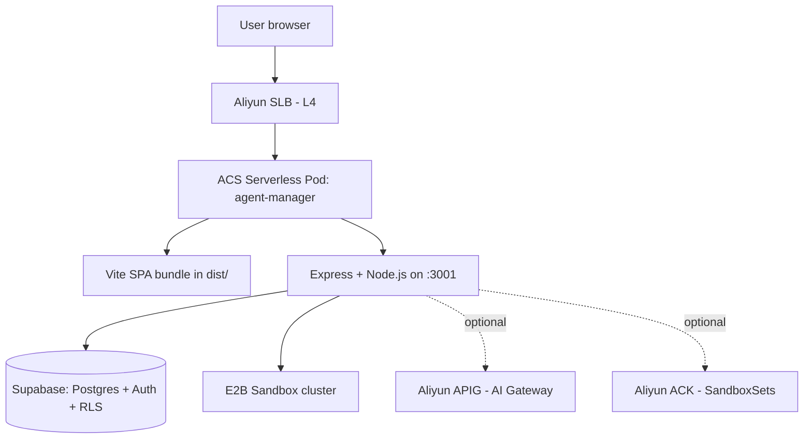
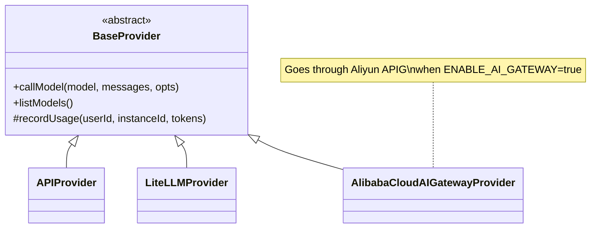
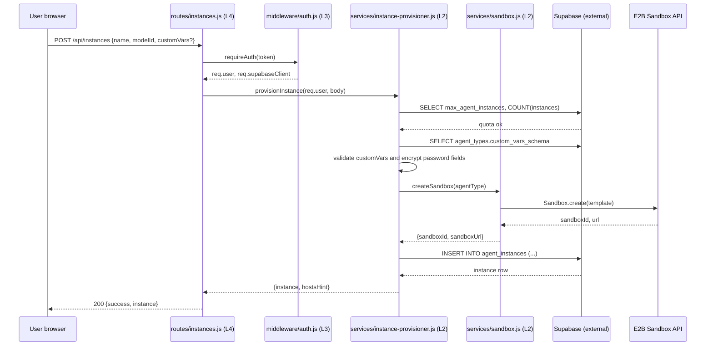

# Architecture

> Source analysis: `agent-manager/server/`, `agent-manager/src/`, `agent-manager/migrations/`, `agent-manager/package.json`, `agent-manager/server/package.json`

## 1 Overview

Agent Manager is a single-process Node.js application packaged as one Docker image. The Express backend (`agent-manager/server/`) serves the REST API under `/api`, while the React + Vite frontend (`agent-manager/src/`) is bundled into `agent-manager/dist/` and served by the same process as static assets with SPA fallback (see [`server/index.js`](../agent-manager/server/index.js)). Persistence lives in [Supabase](https://supabase.com/) (managed Postgres + Auth + RLS); compute isolation lives in [E2B](https://e2b.dev/) sandboxes; LLM traffic optionally routes through Aliyun APIG.

The backend follows a strict **6-layer dependency hierarchy** that is mechanically enforced by `scripts/lint-deps.py`.

> Sources: `agent-manager/server/index.js:1-91`, `agent-manager/package.json:1-72`

## 2 System Architecture

### 2.1 Process & Deployment Topology



> Sources: `agent-manager/Dockerfile`, `agent-manager/docker-compose.yml:1-69`, `agent-manager/server/index.js:30-86`

### 2.2 Backend Layer Hierarchy

<!-- This table MUST stay in sync with LAYERS in scripts/lint-deps.py and the
     Architecture section of AGENTS.md. Cross-file consistency is enforced. -->

| Layer | Packages (relative to `agent-manager/`) | Can Import | Cannot Import |
|-------|------------------------------------------|------------|---------------|
| L0 | `server/config/`, `server/schemas/` | stdlib + npm deps only | anything internal |
| L1 | `server/utils/` | L0 | L2, L3, L4, L5 |
| L2 | `server/services/`, `server/services/providers/` | L0, L1 | L3, L4, L5 (no routes / middleware / openapi) |
| L3 | `server/middleware/`, `server/openapi/` | L0, L1 | L2 (no service imports), L4, L5 |
| L4 | `server/routes/`, `server/routes/internal/` | L0, L1, L2, L3 | L5 (no entry-point imports), peer route file cross-imports |
| L5 | `server/index.js`, `server/frontend-server.js` | L0–L4 | each other |

> Enforced by: `scripts/lint-deps.py` (LAYERS dict + FORBIDDEN_IMPORTS list)

### 2.3 Forbidden Dependencies

These rules are mechanically enforced in addition to the default "layer N can only import layers < N":

- **L3 middleware/openapi must not import L2 services** — middleware does cross-cutting concerns (auth, validation, request logging). Calling business logic from middleware blocks the request handler from controlling the flow. Pass values through `req` instead.
- **L4 routes must not directly call Supabase** — go through a service in L2. Direct DB access from routes bypasses the encryption helpers in `utils/crypto.js` and the quota helpers in `services/instance-provisioner.js`.
- **L4 route files must not import each other** — shared logic belongs in `services/`. If route A needs route B's helpers, extract a service.
- **`server/utils/logger.js`** is the only L1 module that may write to stdout/stderr directly; everywhere else uses `appLogger`.

> Enforced by: `scripts/lint-deps.py:FORBIDDEN_IMPORTS`

### 2.4 Frontend Layer (informational)

The Vite-built frontend follows a lighter convention (not linted today, but documented for consistency):

| Layer | Paths | Purpose |
|-------|-------|---------|
| L0 | `src/types/`, `src/env.d.ts` | Type definitions |
| L1 | `src/lib/`, `src/i18n/` | Supabase client wrapper, API helpers, i18n config |
| L2 | `src/contexts/`, `src/hooks/` | Auth/Terminal contexts, custom hooks |
| L3 | `src/components/` | UI components, including `Auth/` and `observability/` |
| L4 | `src/App.tsx`, `src/main.tsx` | Entry point + router |

> Sources: `agent-manager/src/App.tsx:1-32`, `agent-manager/src/main.tsx`

## 3 Core Components

### 3.1 instance-provisioner

**Purpose**: Owns the full lifecycle of an `OpenClaw` instance — create / start / stop / delete / upgrade — including E2B sandbox allocation, channel binding, `/etc/hosts` hint generation, and quota enforcement.
**Location**: `agent-manager/server/services/instance-provisioner.js` (~750 lines)
**Design doc**: [design-docs/instance-provisioner.md](design-docs/instance-provisioner.md)

**Key entry points (imported by `routes/instances.js`)**:

| Function | File:Line (approx.) | Purpose |
|----------|---------------------|---------|
| `provisionInstance` | `services/instance-provisioner.js` | Create + start a new sandbox, persist row |
| `startInstance` / `stopInstance` | `services/instance-provisioner.js` | Idempotent sandbox start/stop |
| `deleteInstance` | `services/instance-provisioner.js` | Cleanup sandbox, mounts and channel bindings |
| `getInstanceWithHosts` | `services/instance-provisioner.js` | Returns instance row + `/etc/hosts` hint for `DEPLOY_ENVIRONMENT=local-dev` |

> Sources: `agent-manager/server/services/instance-provisioner.js`, `agent-manager/server/routes/instances.js`

### 3.2 providers (LLM provider abstraction)

**Purpose**: Pluggable LLM backends with shared auth, request shaping, error wrapping and per-tenant budget bookkeeping.
**Location**: `agent-manager/server/services/providers/`
**Design doc**: [design-docs/providers.md](design-docs/providers.md)



> Sources: `agent-manager/server/services/providers/BaseProvider.js`, `APIProvider.js`, `LiteLLMProvider.js`, `AlibabaCloudAIGatewayProvider.js`, `budget.js`

### 3.3 channel-auto-config (IM channel automation)

**Purpose**: Onboard IM channels (DingTalk / Feishu / WeCom) via QR scan + OAuth without manual credential paste; persist encrypted credentials and register webhooks.
**Location**: `agent-manager/server/services/{dingtalk,feishu,wecom}-auto-config.js`, `agent-manager/server/routes/channel-auto-config.js`
**Design doc**: [design-docs/channels.md](design-docs/channels.md)

### 3.4 sandbox + terminal

**Purpose**: Allocate E2B `Sandbox` objects for each instance and expose an authenticated WebSocket terminal in the browser (xterm.js client ↔ Express WS proxy ↔ sandbox shell).
**Location**: `agent-manager/server/services/sandbox.js`, `agent-manager/server/services/terminal.js`, `agent-manager/server/routes/terminal.js`
**Design doc**: [design-docs/sandbox-terminal.md](design-docs/sandbox-terminal.md)

## 4 Data Flow

### 4.1 Create-Instance Happy Path



> Sources: `agent-manager/server/routes/instances.js`, `agent-manager/server/services/instance-provisioner.js`, `agent-manager/server/middleware/auth.js`

### 4.2 Error Handling Convention

- All `services/` functions throw plain `Error` with a stable `code` string property (e.g. `QUOTA_EXCEEDED`, `SANDBOX_UNAVAILABLE`, `CHANNEL_AUTH_FAILED`).
- `routes/` translate via a small switch: `code → HTTP status`. Unknown codes fall through to `500 { success: false, error: err.message }`.
- All cross-cutting logs go through `appLogger` from [`server/utils/logger.js`](../agent-manager/server/utils/logger.js); raw `console.*` is reserved for bootstrap output in `server/index.js` and `server/config/index.js`.

## 5 Critical Files

| File | Approx. lines | Purpose |
|------|---------------|---------|
| `agent-manager/server/index.js` | ~90 | Entry — wires middleware, routes, OpenAPI, static frontend |
| `agent-manager/server/config/index.js` | ~275 | Env loader, Supabase admin client, E2B DNS resolution |
| `agent-manager/server/routes/instances.js` | ~1700 | Instance CRUD + start/stop/upgrade + admin proxy |
| `agent-manager/server/services/instance-provisioner.js` | ~750 | Provisioning + sandbox lifecycle |
| `agent-manager/server/services/gateway-config.js` | ~1100 | AI Gateway config loader + CMS/SLS Aliyun client factory |
| `agent-manager/server/services/cms-integration.js` | ~800 | Aliyun CMS observability integration |
| `agent-manager/server/utils/agent-config.js` | ~900 | Per-instance config assembly (model + skills + channels) |
| `agent-manager/server/utils/logger.js` | ~190 | `appLogger`, request context (AsyncLocalStorage) |
| `agent-manager/src/App.tsx` | ~220 | SPA router + role gate |
| `agent-manager/migrations/init-db.js` | — | Migration runner (`migrate`, `drop`, `full`) |

## 6 Key Design Decisions

| # | Decision | Rationale |
|---|----------|-----------|
| 1 | Single-container deploy (frontend + backend) | Simplifies ROS template; cuts SLB hops; acceptable because horizontal scale is per-pod |
| 2 | Supabase for both Auth and Postgres | RLS gives us tenant isolation "for free" and avoids a custom permission layer |
| 3 | E2B for sandboxing instead of running Docker-in-pod | Avoids privileged containers; offloads orchestration; we only need a typed Sandbox SDK |
| 4 | Provider abstraction with budget bookkeeping in `BaseProvider` | Keeps budget logic out of `routes/`; every provider gets quota enforcement automatically |
| 5 | Encrypted-at-rest credentials via `utils/crypto.js` | Channel + provider secrets live in Postgres; encryption key is the only operator-managed secret |
| 6 | Immutable migrations checksummed in `schema_migrations` | Prevents in-place edits to already-shipped SQL files from corrupting tenants on upgrade |

## 7 Module & Dependencies

```
agent-manager/         frontend + bundler   (Vite 6 + React 18 + TypeScript 5)
agent-manager/server/  backend (Node 18+, Express 4, ESM)
```

**Notable runtime dependencies** (see [`agent-manager/package.json`](../agent-manager/package.json) + [`agent-manager/server/package.json`](../agent-manager/server/package.json)):

| Dependency | Where | Purpose |
|-----------|-------|---------|
| `@supabase/supabase-js` | both | Postgres / Auth client |
| `@e2b/code-interpreter` | server | Sandbox SDK |
| `@kubernetes/client-node` | both | SandboxSet CRD operations |
| `@alicloud/*` (APIG, CMS, SLS, STS) | server | AI Gateway + observability integrations |
| `express` + `ws` + `cors` | server | HTTP / WebSocket / CORS |
| `zod` + `@asteasolutions/zod-to-openapi` + `@scalar/api-reference` | server | Schema + OpenAPI generation |
| `react-router-dom` + `i18next` + `tailwindcss` + `lucide-react` | frontend | UI stack |

## See Also

- [design-docs/instance-provisioner.md](design-docs/instance-provisioner.md)
- [design-docs/providers.md](design-docs/providers.md)
- [design-docs/channels.md](design-docs/channels.md)
- [design-docs/sandbox-terminal.md](design-docs/sandbox-terminal.md)
- [DEVELOPMENT.md](DEVELOPMENT.md)
- [PRODUCT_SENSE.md](PRODUCT_SENSE.md)
