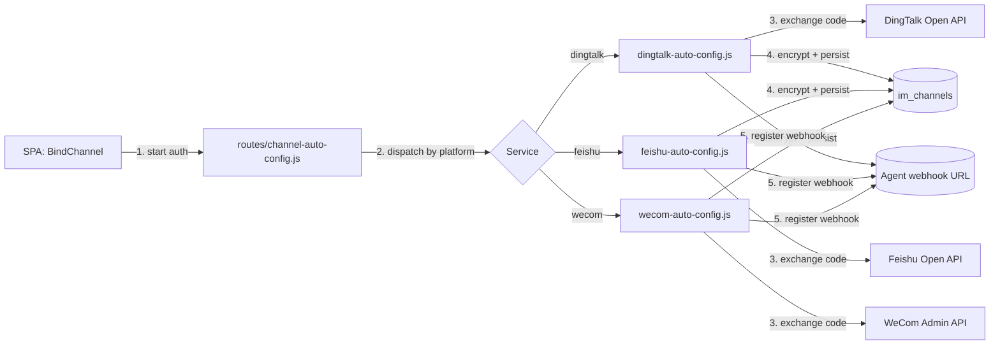
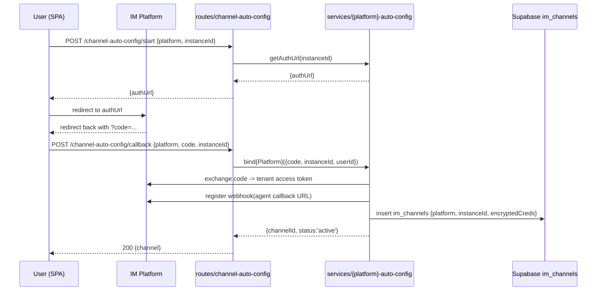

# Channel Auto-Config

> Sources:
> - [`routes/channel-auto-config.js`](../../agent-manager/server/routes/channel-auto-config.js)
> - [`services/dingtalk-auto-config.js`](../../agent-manager/server/services/dingtalk-auto-config.js)
> - [`services/feishu-auto-config.js`](../../agent-manager/server/services/feishu-auto-config.js)
> - [`services/wecom-auto-config.js`](../../agent-manager/server/services/wecom-auto-config.js)
> - [`agent-manager/data/channels/*.json`](../../agent-manager/data/channels/) (templates)

## Overview

A **Channel** binds a running agent instance to an IM platform (DingTalk,
Feishu, WeCom, QQ, WeChat). The Channel Auto-Config flow lets users wire up
a channel without manually copying tokens — they authorize the platform's
OAuth/QR flow, the backend exchanges short-lived codes for tenant credentials,
encrypts them, and registers the agent's webhook with the IM platform.

This module is the **only place** that talks to the IM platforms' admin APIs;
everything else reads from `im_channels`.

## Architecture

## Key Interfaces

| Symbol | File:line | Purpose |
|--------|-----------|---------|
| `POST /api/channel-auto-config/start` | `routes/channel-auto-config.js` | Issues OAuth URL or QR session for platform |
| `POST /api/channel-auto-config/callback` | `routes/channel-auto-config.js` | Handles platform redirect; calls service for code-exchange |
| `bindDingTalk({code, instanceId, userId})` | `services/dingtalk-auto-config.js` | Token exchange + persist + webhook register |
| `bindFeishu({code, instanceId, userId})` | `services/feishu-auto-config.js` | Same shape, Feishu-specific endpoints |
| `bindWeCom({code, instanceId, userId})` | `services/wecom-auto-config.js` | Same shape, WeCom-specific endpoints |
| `data/channels/*.json` | (static) | Per-platform template: required fields, scopes, webhook contract |

## Execution Flow

## Channel Templates

The static JSON files in [`agent-manager/data/channels/`](../../agent-manager/data/channels/)
declare the per-platform contract — which credential fields exist, which are
secret (will go through `encryptApiKey`), and what the agent gateway webhook
URL looks like. Admins can extend `data/channels/` to add platforms without
touching server code, *as long as the platform follows the OAuth-code pattern*.

| File | Platform |
|------|----------|
| `dingtalk-channel.json` | DingTalk (钉钉) |
| `feishu-channel.json` | Feishu / Lark (飞书) |
| `wecom-channel.json` | Enterprise WeChat (企业微信) |
| `qq-channel.json` | QQ Open Platform |

## Error Handling

- Code-exchange failures bubble as `Error` with the platform's `errcode` in
  the message; route returns `400` (`"failed to exchange code"`).
- Duplicate-bind attempts (same `instance_id` + `platform`) are caught by a
  unique index on `im_channels` and rejected with `409`.
- Credentials are encrypted **before** the row hits Supabase and are only
  decrypted by the backend when configuring the Agent channel.

## Configuration & Environment

| Env var | Used by | Purpose |
|---------|---------|---------|
| `API_ENCRYPTION_KEY` | `utils/crypto.js` | Encrypt tenant secret at rest |
| platform app IDs / secrets | row in `provider_config` or env | Per-tenant credentials used to exchange the OAuth code |

## Why this design

- **One file per platform** — every IM platform has bespoke quirks (e.g.,
  DingTalk's nested `errcode`, WeCom's IP allowlist). Forcing them into a
  generic adapter would make the file unreadable; a flat
  `services/{platform}-auto-config.js` is easier to debug.
- **Templates separate schema from logic** — adding a new field (e.g. a new
  webhook event) is a JSON edit, not a code change.
- **Routes never see plaintext credentials** — the encryption boundary is
  inside each `bind{Platform}` service.

## See Also

- [`docs/ARCHITECTURE.md`](../ARCHITECTURE.md) §3.3
- [instance-provisioner.md](instance-provisioner.md) — creates the underlying instance
