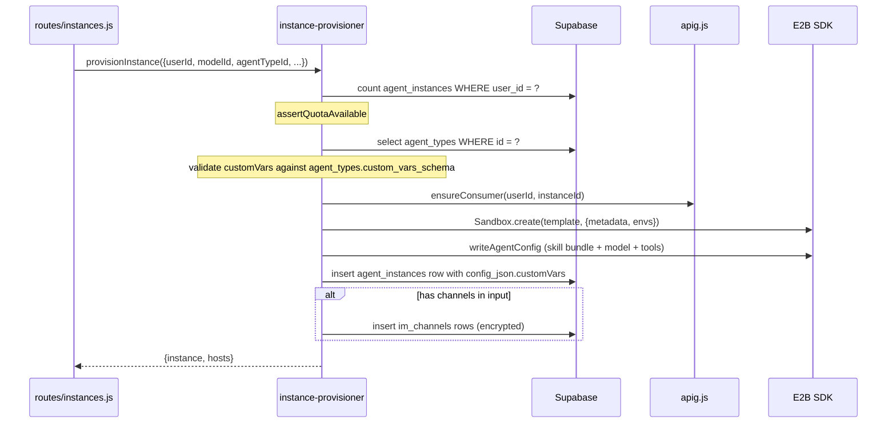

# Instance Provisioner

> Source: [`agent-manager/server/services/instance-provisioner.js`](../../agent-manager/server/services/instance-provisioner.js)
> Consumers: [`routes/instances.js`](../../agent-manager/server/routes/instances.js), `POST /api/instances`, `POST /api/admin/instances`

## Overview

The Instance Provisioner orchestrates end-to-end creation of an **OpenClaw**
(agent instance). It is the single chokepoint that turns a `POST /api/instances`
request into:

1. A row in `agent_instances`
2. An E2B sandbox running the agent image
3. A provisioned APIG consumer + per-instance authorization
4. (Optionally) channel rows that bind the instance to IM platforms
5. (Optionally) per-instance custom variables defined by the selected Agent Type

The provisioner is intentionally **service-level** (Layer 2) — routes call it
with already-validated input, and it owns the entire side-effect graph.

## Architecture

```mermaid
graph TB
  Route[routes/instances.js] -->|input + userId| IP[instance-provisioner.js]
  IP -->|1. quota| DB[(Supabase agent_instances)]
  IP -->|2. agent type| AT[utils/agent-config.js]
  IP -->|3. consumer key| APIG[services/apig.js]
  IP -->|4. provider lookup| PF[providers/index.js]
  IP -->|5. sandbox create| E2B[@e2b/code-interpreter]
  IP -->|6. skill inject| SI[utils/skill-injector.js]
  IP -->|7. persist row| DB
  IP -->|8. channel rows| CH[(im_channels)]
```

## Key Interfaces

| Symbol | File:line | Purpose |
|--------|-----------|---------|
| `provisionInstance(input)` | `services/instance-provisioner.js` | Main entry, returns the instance and optional local DNS hints |
| `ProvisionError(message, status)` | `services/instance-provisioner.js:45` | Typed error carrying HTTP status |
| `assertQuotaAvailable({userId, userProfile})` | `services/instance-provisioner.js:55` | Enforces `max_agent_instances` |
| `resolveAgentType(id)` | `services/instance-provisioner.js:76` | Loads template; defaults to `openclaw` |
| `getGatewayConfig()` | `services/gateway-config.js` | Loads + decrypts gateway / APIG credentials |
| `createProviderFromDB(name)` | `services/providers/index.js:40` | Builds the LLM provider object |
| `waitForSandboxReady(sandbox)` | `services/sandbox.js` | Polls sandbox health after `Sandbox.create` |

## Execution Flow (happy path)



## State Model

`agent_instances.status` lifecycle:

| State | Set by | Meaning |
|-------|--------|---------|
| `pending` | provisioner pre-sandbox | Row inserted, sandbox not yet attached |
| `running` | provisioner post-sandbox | Sandbox and Agent runtime are ready |
| `stopped` | `POST /api/instances/:id/stop` | Sandbox killed, row retained |
| `failed` | provisioner on error path | Cleanup attempted; user may retry |

> The provisioner is **not** transactional — partial failures are cleaned up
> with best-effort rollback (delete consumer, kill sandbox) and reported as
> `ProvisionError` with HTTP 500. See the `// Cleanup on failure` blocks in
> `instance-provisioner.js`.

## Custom Variables

Agent Types can declare `custom_vars_schema` so admins can collect per-instance
inputs, such as project tokens, webhook URLs, external API keys, or system
prompts. `POST /api/instances` accepts those values as `customVars`.

The provisioner validates `customVars` before it creates the sandbox:

- Every submitted key must appear in the selected Agent Type schema.
- Required fields must be present.
- `password` values are encrypted with `encryptApiKey()` and stored with the
  `encrypted:` prefix.
- `text` and `textarea` values are stored as submitted.

Processed values are written to `agent_instances.config_json.customVars` and
passed to `utils/agent-config.js`. That utility merges them into the template
variable map without overriding built-in variables such as `MODEL_NAME`,
`CHANNEL_TYPE`, and `CONSUMER_API_KEY`.

If the Agent Type sets `supports_env_vars = true`, config generation keeps
`${VAR_NAME}` placeholders in the sandbox config file and writes actual values
to a sibling `.env` file. The agent runtime must load that `.env` file itself.

Custom variables can be referenced as `${VAR_NAME}` in:

- `agent_types.startup_command`
- `agent_types.config_template`
- `agent_types.modify_model_command`
- `agent_types.modify_channel_command`

During startup and modify-command execution, non-empty template variables are
routed through process environment variables named `_AGENT_<VAR_NAME>`. This
keeps secrets and user-controlled values out of generated shell source while
still allowing the sandbox process to read them.

## Error Handling

- All errors thrown from the provisioner are `ProvisionError` with `.status`.
- `routes/instances.js` translates `.status` directly to the HTTP response code.
- `console.error(...)` / `appLogger.error(...)` is called at each failure site
  with `{userId, instanceId, step}` context so admin observability can correlate
  failures across services.

## Configuration & Environment

| Env var | Read at | Purpose |
|---------|---------|---------|
| `E2B_API_KEY`, `E2B_DOMAIN` | `config/index.js` | Sandbox auth + custom DNS |
| `DEPLOY_ENVIRONMENT` | `config/index.js` | If `local-dev`, returns `/etc/hosts` hint |
| `E2B_HOSTS_IP` | `config/index.js` | IP the SPA should write to `/etc/hosts` |
| `OSS_PV_NAME`, `VITE_OSS_PV_NAME` | `config/index.js` | Skill Hub PV mount |
| `BACKUP_MOUNT_PATH` | `config/index.js` | CSI backup mount for sandbox upgrades |
| `ENABLE_AI_GATEWAY` | `config/index.js` | Gates APIG consumer creation |

## Why this design

- **Provisioning is high-fanout** — touches Supabase, E2B, APIG, K8s. Keeping
  it in a single service makes the side-effect graph explicit (you can read
  the function top-to-bottom) and avoids spreading retry/rollback logic across
  HTTP handlers.
- **Errors are typed (`ProvisionError`)** so routes don't have to know about
  step-specific failure modes; they just propagate `.status`.
- **No HTTP layer access** — the provisioner takes plain inputs (`userId`,
  `userProfile`) so it can also be driven from `routes/internal/` and tests.

## See Also

- [`docs/ARCHITECTURE.md`](../ARCHITECTURE.md) §3.1, §4.1
- [providers.md](providers.md) — model resolution sub-system
- [sandbox-terminal.md](sandbox-terminal.md) — sandbox lifecycle details
- [`agent-manager/server/services/sandbox-upgrades.js`](../../agent-manager/server/services/sandbox-upgrades.js) — upgrade flow that reuses the provisioner
