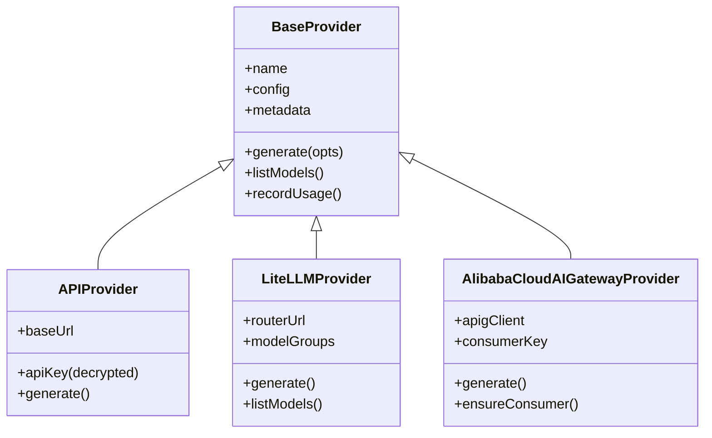
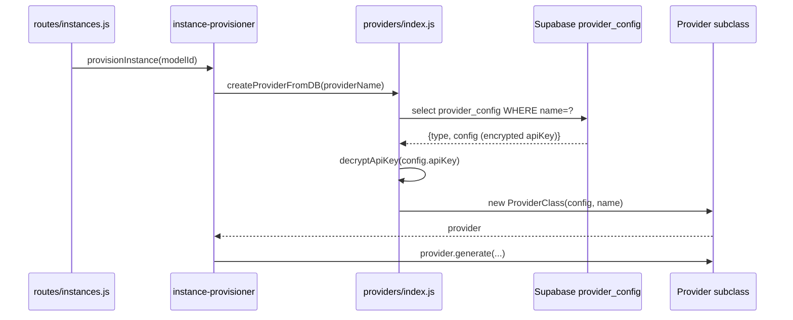

# LLM Providers

> Source: [`agent-manager/server/services/providers/`](../../agent-manager/server/services/providers/)
> Consumers: [`routes/providers.js`](../../agent-manager/server/routes/providers.js),
> [`routes/models.js`](../../agent-manager/server/routes/models.js),
> [`services/instance-provisioner.js`](../../agent-manager/server/services/instance-provisioner.js)

## Overview

The Providers module abstracts the many ways the platform can talk to LLMs:
direct OpenAI-compatible HTTP, a self-hosted LiteLLM router, or Aliyun's
managed AI Gateway (APIG). Every concrete provider speaks the same minimal
interface (`generate`, `listModels`, `quote`, `recordUsage`), so callers don't
care which backend is configured.

Configuration lives in the `provider_config` Supabase table; the registry maps
the row's `type` column to a concrete class.

## Class Hierarchy

## Key Interfaces

| Symbol | File:line | Purpose |
|--------|-----------|---------|
| `BaseProvider` | `services/providers/BaseProvider.js` | Abstract base — defines `generate / listModels / recordUsage` |
| `APIProvider` | `services/providers/APIProvider.js` | OpenAI-compatible REST client (DashScope, OpenRouter, ...) |
| `LiteLLMProvider` | `services/providers/LiteLLMProvider.js` | Calls a self-hosted LiteLLM router; supports virtual model groups |
| `AlibabaCloudAIGatewayProvider` | `services/providers/AlibabaCloudAIGatewayProvider.js` | Calls Aliyun APIG with per-consumer auth |
| `createProvider(name, type, config)` | `services/providers/index.js:25` | Factory keyed on `type` |
| `createProviderFromDB(name)` | `services/providers/index.js:40` | Loads + decrypts `provider_config` row |
| `getAllProviders()` | `services/providers/index.js:69` | Lists all enabled providers |
| `budget.js` | `services/providers/budget.js` | Per-user `daily_token_limit` bookkeeping |

## Resolution Flow

## Provider Type Registry

| `type` column | Class | When to use |
|---------------|-------|-------------|
| `API` | `APIProvider` | Any OpenAI-compatible endpoint (DashScope, vLLM, OpenRouter) |
| `LiteLLM` | `LiteLLMProvider` | Self-hosted LiteLLM with virtual model groups + fallback |
| `AlibabaCloudAIGateway` | `AlibabaCloudAIGatewayProvider` | Aliyun-managed APIG (consumer-keyed, per-tenant authorization) |

Unknown types throw `Unknown provider type: ${type}` at registry lookup
(see `services/providers/index.js:29`) — adding a new backend means a new
class + one line in `PROVIDER_REGISTRY`.

## Error Handling

- Providers throw `Error` with provider-prefixed messages (e.g.
  `"[LiteLLM] upstream 502 from model gpt-4o-mini"`).
- `routes/models.js` and `routes/providers.js` catch and respond `502 Bad
  Gateway` for upstream errors, `400` for missing config.
- API keys are **always** read via `decryptApiKey()` (`utils/crypto.js`) —
  the constructor never sees ciphertext.

## Budget Tracking

`providers/budget.js` exposes:

- `checkDailyBudget(userId)` — used in `routes/models.js` before forwarding
  a streamed request.
- `recordUsage({userId, providerName, modelName, promptTokens, completionTokens, costUsd})`
  — invoked from the provider after the stream closes, writes to
  `token_usage_logs`.

`principal_profiles.daily_token_limit = 0` disables the cap; non-zero values are
compared against the day's running total in `token_usage_logs`.

## Configuration & Environment

| Where | What |
|-------|------|
| `provider_config.config` (JSON) | Per-provider `{baseUrl, apiKey (encrypted), defaultModel, ...}` |
| `API_ENCRYPTION_KEY` env | AES-GCM key used by `utils/crypto.js` to decrypt `apiKey` |
| `ENABLE_AI_GATEWAY` env | Gates registration of `AlibabaCloudAIGateway` instances |
| `provider_config.enabled` | Soft toggle exposed in admin UI |

## Why this design

- **Adding a backend is a one-class change** — keeps `instance-provisioner.js`
  and `routes/*` provider-agnostic.
- **`config` is opaque JSON** — each subclass owns its schema, so adding a
  new auth scheme doesn't require migrations.
- **Encryption boundary is in the factory** — every provider object holds a
  decrypted key in memory only; the DB never sees plaintext.

## See Also

- [`docs/ARCHITECTURE.md`](../ARCHITECTURE.md) §3.2
- [instance-provisioner.md](instance-provisioner.md) — primary consumer
- [`agent-manager/server/utils/crypto.js`](../../agent-manager/server/utils/crypto.js) — key encryption
- [`agent-manager/server/services/gateway-config.js`](../../agent-manager/server/services/gateway-config.js) — APIG credential storage
