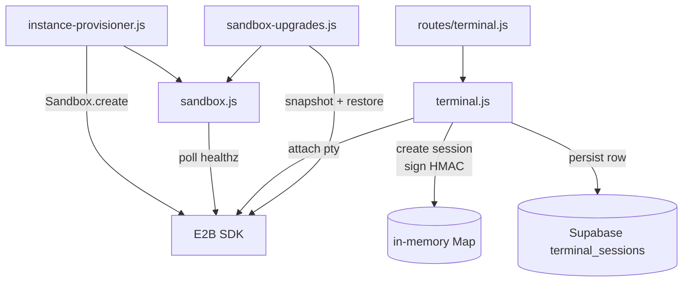
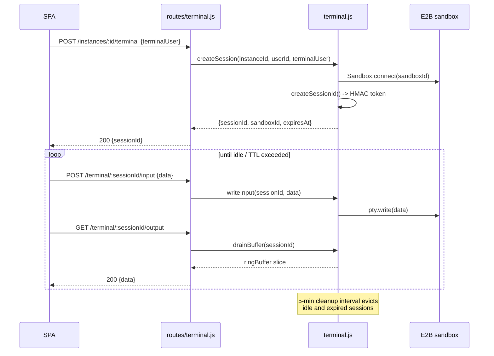

# Sandbox & Terminal

> Sources:
> - [`services/sandbox.js`](../../agent-manager/server/services/sandbox.js)
> - [`services/terminal.js`](../../agent-manager/server/services/terminal.js)
> - [`routes/terminal.js`](../../agent-manager/server/routes/terminal.js)
> - [`services/sandbox-upgrades.js`](../../agent-manager/server/services/sandbox-upgrades.js)

## Overview

Each OpenClaw instance runs inside an **E2B sandbox** — a remote container
managed by [`@e2b/code-interpreter`](https://e2b.dev/). Two services own
sandbox interaction:

- **`sandbox.js`** — lifecycle helpers (`waitForSandboxReady`,
  `waitForGatewayReady`), used by the provisioner and upgrade flow.
- **`terminal.js`** — session-scoped interactive shell over the sandbox,
  exposed to the SPA via WebSocket-style polling endpoints
  (`/api/instances/:id/terminal/*`).

Terminal sessions are cryptographically signed tokens; the server holds the
authoritative `Sandbox` handles in an in-memory `Map` keyed by session ID.

## Architecture

## Key Interfaces

### `sandbox.js`

| Symbol | Purpose |
|--------|---------|
| `waitForSandboxReady(sandbox, opts)` | Polls sandbox until init script completes |
| `waitForGatewayReady(url, opts)` | Waits for agent gateway inside sandbox to respond `200` |
| `getSandboxStatus(sandboxId)` | Wraps E2B status API for admin views |

### `terminal.js`

| Symbol | File:line | Purpose |
|--------|-----------|---------|
| `TerminalError(status, code, message)` | `terminal.js:21` | Typed error with explicit HTTP status |
| `createSessionId(session)` | `terminal.js:47` | HMAC-signed `payload.signature` session token |
| `signSessionPayload(encoded)` | `terminal.js:34` | HMAC-SHA256 over the encoded payload |
| `safeEqualString(a, b)` | `terminal.js:41` | Constant-time comparison for signature verification |
| In-memory `sessions: Map` | `terminal.js:16` | Holds live `Sandbox` handles + buffers per session |

## Terminal Session Lifecycle

## Session Tokens

A `sessionId` is `base64url(JSON.stringify(payload)).base64url(HMAC-SHA256(payload))`.
The payload binds the session to:

- `instanceId` + `userId` — server can re-derive permissions on every request
- `sandboxId` — the actual E2B container
- `terminalUser` — Linux user inside the sandbox (default `node`)
- `createdAt` + `expiresAt` — short-lived (`TERMINAL_SESSION_TTL_SECONDS`)

Signature verification uses `crypto.timingSafeEqual`, so an attacker can't
brute-force the HMAC byte-by-byte.

## Resource Limits

| Limit | Env var | Default |
|-------|---------|---------|
| Sessions per instance | `TERMINAL_MAX_SESSIONS_PER_INSTANCE` | 1 |
| Sessions per user | `TERMINAL_MAX_SESSIONS_PER_USER` | 4 |
| Output buffer per session | `TERMINAL_OUTPUT_BUFFER_BYTES` | 64 KB |
| Idle timeout | `TERMINAL_IDLE_TIMEOUT_SECONDS` | 300 |
| Hard session lifetime | `TERMINAL_SESSION_MAX_LIFETIME_SECONDS` | 3600 |
| Token TTL | `TERMINAL_SESSION_TTL_SECONDS` | 900 |
| HMAC secret | `TERMINAL_SESSION_SECRET` | (required, no default) |

Exceeding `MAX_SESSIONS_*` returns `TerminalError(429, 'session-limit')`.

## Sandbox Upgrades

`sandbox-upgrades.js` reuses `sandbox.js` helpers to:

1. Snapshot the running sandbox's writable mount (`buildBackupVolumeConfig`)
2. Re-provision via `instance-provisioner` against the new image
3. Restore mounts; if anything fails, roll back to the original sandbox

Backup metadata lives in `agent_instances.sandbox_upgrade_state` (JSON).

## Error Handling

- `terminal.js` always throws `TerminalError(status, code, message)` so
  routes can `res.status(err.status).json({code, message})` uniformly.
- E2B SDK errors are wrapped with `code: 'sandbox-down'` to make UI retries
  easy to classify.
- Sessions are evicted on any `Sandbox.reconnect()` failure to avoid stale
  handles holding ports open.

## Why this design

- **Sessions in-memory, not in Redis** — single Node process today, no need
  for a shared session store. If multi-replica becomes a thing, the
  `sessions: Map` is the single replacement point.
- **HMAC token > opaque DB lookup** — every request validates the token in
  ~µs without a DB roundtrip; revocation is via session ID eviction.
- **Sandbox helpers are stateless** so they can be reused by both the
  provisioner (creation) and the upgrade flow (recreation).

## See Also

- [`docs/ARCHITECTURE.md`](../ARCHITECTURE.md) §3.4
- [instance-provisioner.md](instance-provisioner.md) — owns initial sandbox creation
- [`agent-manager/server/utils/skill-injector.js`](../../agent-manager/server/utils/skill-injector.js) — writes skills into the sandbox
