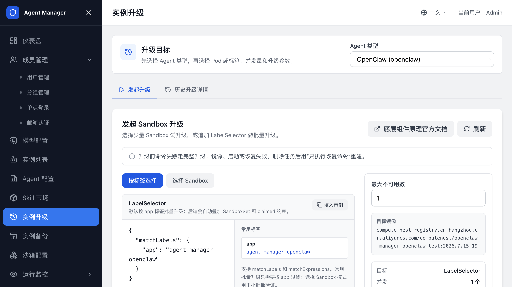

# Agent 升级

本页介绍如何更换沙箱镜像、启动命令或运行参数，并把正在运行的 Agent Sandbox 迁移到新配置。升级会重建选中的 Sandbox，可能造成短暂中断；请先用测试实例验证。

升级前需要准备可用的备份和恢复命令。备份点的创建和恢复操作见 [Agent 备份](Agent备份.md)。

## 配置升级前后的备份和恢复命令

在升级前，为对应 Agent 类型配置升级前备份命令和升级后恢复命令。升级时，平台会重建底层 Pod；只有写入 `/backup` 并成功恢复的数据才会保留。

1. 打开管理后台，进入“Agent 配置”。
2. 打开目标 Agent 类型详情，进入“备份&升级配置”。
3. 确认关联 SandboxSet、命名空间、目标镜像和命令超时时间。
4. 填写“升级前命令”，把需要保留的数据写入 `/backup`。
5. 填写“升级后恢复命令”，从 `/backup` 恢复数据到新 Pod 的工作目录。
6. 保存配置。
7. 先在测试 Sandbox 上执行一次升级，确认数据和应用访问正常。

命令必须覆盖 Agent 的实际数据目录。页面提供的示例只适用于对应 Agent 类型的默认目录；如果要恢复较早的备份文件，请把恢复命令改成指定文件名，不要依赖“最新文件”的自动选择。

## 确认 Sandbox 具备升级条件

在“实例升级”页面看不到目标 Sandbox，或实例显示“不可安全升级”时，先检查以下条件：

| 检查项 | 要求 |
| --- | --- |
| SandboxSet | 同时包含 `agent-runtime` 和 `csi` runtime，能够挂载 `/backup`。 |
| 实例 | 创建时已写入备份挂载信息。只修改 SandboxSet 不会自动修复已运行实例。 |
| Agent 类型 | 已保存升级前命令和升级后恢复命令。 |
| 备份目录 | `/backup` 可写，备份命令能生成非空文件。 |

新建实例会按修复后的 SandboxSet 生成备份挂载。旧实例如果缺少创建时的挂载信息，需要重建实例，或由管理员按集群运维流程补齐后再升级。

## 发起单个或批量 Sandbox 升级

升级前先确认业务允许短暂中断，并确认同一命名空间没有正在处理的升级任务。

1. 打开管理后台，进入“实例升级”。
2. 选择 Agent 类型，等待可升级 Sandbox 列表加载。
3. 选择少量 Sandbox 做试升级，或切换到“按标签选择”配置批量范围。
4. 设置最大不可用数和命令超时时间。
5. 单击“发起完整升级”。
6. 在“历史升级详情”中查看进度和失败对象。

平台会根据最新 SandboxSet 自动生成升级所需的镜像、命令、环境变量和挂载变更。您不需要手动填写底层升级资源。

同一命名空间同时只能有一个未完成的升级任务。已有“等待中”“升级中”或“失败”任务时，请先等待、删除或修复该任务。

## 升级失败后重试

先打开“历史升级详情”，查看失败阶段、Reason 和 Message，再按下表处理：

| 失败阶段 | 处理方法 |
| --- | --- |
| 升级前命令失败 | 检查待备份目录、`/backup` 挂载和命令退出码。修复后重新发起完整升级。 |
| 镜像或 Pod 启动失败 | 检查目标镜像、启动命令和探针。删除失败任务后重新发起升级。 |
| 升级后恢复命令失败 | 检查备份文件路径、恢复目录和校验文件。删除失败任务后选择“只执行恢复命令”。 |
| 命名空间已有未完成任务 | 等待任务完成，或在历史详情中删除、修复失败任务。 |

只有在升级前备份命令已经成功时，才使用“只执行恢复命令”。否则必须重新执行完整升级，先生成新的备份再替换 Sandbox。

## 相关文档

- [返回文档首页](index.md)
- [Agent 备份](Agent备份.md)
- [配置 Agent 类型](配置Agent类型.md)
- [配置沙箱（SandboxSet）](配置SandboxSet.md)
- [创建和管理 Agent 实例](创建和管理Agent实例.md)
- [发布记录](release-notes/README.md)
- [常见问题与排障](常见问题与排障.md)
