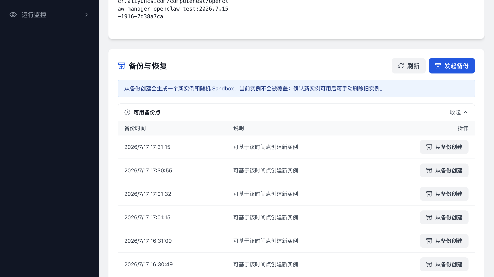
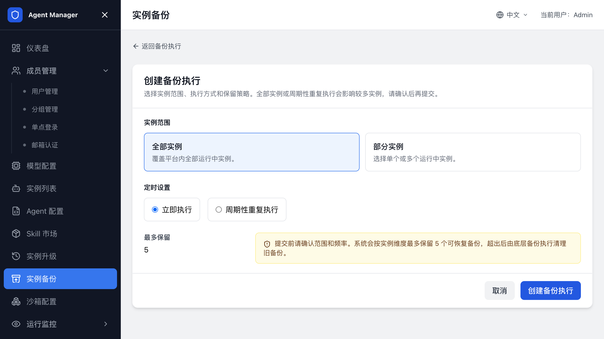

# Agent 备份

本页介绍如何为 Agent 实例保留可恢复的备份点，以及如何从备份点创建新实例。备份只保存实例数据，不会修改实例的模型、镜像或运行配置，也不会启动沙箱升级。

## 选择备份方式

| 目标 | 入口 | 结果 |
| --- | --- | --- |
| 保留某个实例的可恢复时间点 | 实例详情 -> 备份与恢复 | 生成当前实例的备份点。 |
| 从备份点创建一份新实例 | 实例详情 -> 备份与恢复 | 创建新实例和新 Sandbox，原实例不变。 |
| 给多个实例创建立即或周期备份 | 管理后台 -> 实例备份 | 按全部实例或指定实例执行，并设置保留数量。 |

## 只做备份：保留一个实例的恢复点

实例必须已经创建并关联可用 Sandbox。备份过程中会短暂占用实例；实例正在备份或恢复时，新的备份请求会被拒绝。

1. 打开实例列表，进入目标实例详情。
2. 在“备份与恢复”区域单击“发起备份”。
3. 在确认页面单击“确认发起”。
4. 返回实例详情，展开“可用备份点”查看备份时间和状态。

备份点只属于当前实例。备份执行完成后，您可以基于该时间点创建新实例。

## 从备份创建新实例

从备份创建会保留原实例，并使用新的 Sandbox 恢复备份数据。新实例创建完成后，请先验证工作台和配置，再决定是否删除原实例。

1. 打开源实例详情，展开“可用备份点”。
2. 在目标备份点单击“从备份创建”。
3. 填写新实例名称，单击“创建新实例”。
4. 进入新实例详情，等待 Sandbox Ready、配置写入和访问检查完成。
5. 进入 Agent 工作台，确认 Agent 状态、模型调用和需要保留的数据正常。

新实例归属源实例的所有者。恢复失败时，查看新实例详情中的错误信息；源实例和备份点不会被覆盖。

## 创建全部或部分实例的备份任务

管理员可以一次备份全部运行中实例，也可以按 Agent 类型、分组和实例名称选择部分实例。

1. 打开管理后台，进入“实例备份”。
2. 单击“创建备份执行”。
3. 选择实例范围：全部实例，或指定实例。
4. 选择“立即执行”或“周期性重复执行”。
5. 设置每个实例最多保留的备份点数量。
6. 选择周期执行时，填写 Cron 表达式并确认页面显示的下次执行时间。
7. 单击创建，返回“实例备份”查看执行状态。

备份执行状态包括“运行中”“成功”“异常”“部分失败”和“已取消”。打开执行详情可以查看实例范围、最近一次结果、下次执行时间和失败信息。取消周期任务只会停止后续执行，已经生成的备份点不会删除。

## 相关文档

- [返回文档首页](index.md)
- [创建和管理 Agent 实例](创建和管理Agent实例.md)
- [Agent 升级](Agent升级.md)
- [配置 Agent 类型](配置Agent类型.md)
- [配置沙箱（SandboxSet）](配置SandboxSet.md)
- [常见问题与排障](常见问题与排障.md)
