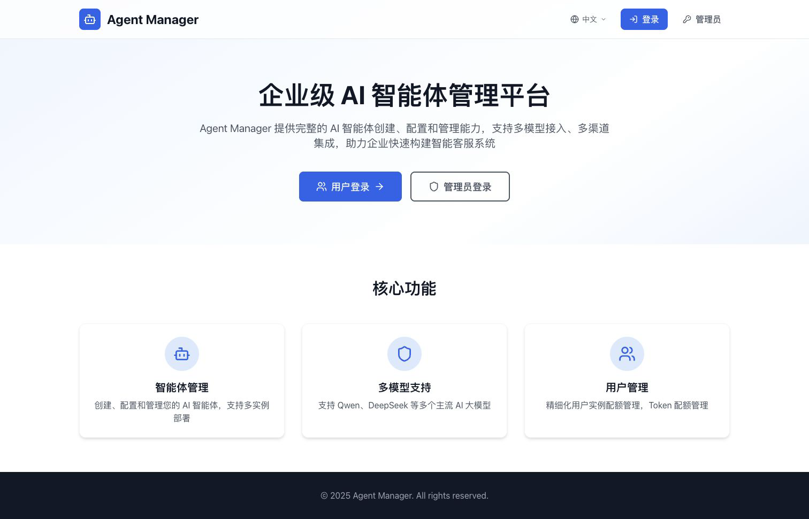
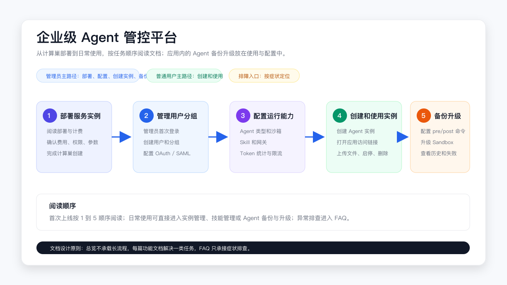

# 企业级 Agent 管控平台

本平台帮助企业在阿里云上统一管理 Agent。管理员负责部署平台、配置用户、模型、Agent 类型和沙箱；团队成员登录用户工作台后创建并使用 Agent 实例。

## 使用这份文档

管理员先阅读管理员指南完成平台部署和配置；普通用户直接阅读[用户指南](用户指南.md)，从登录开始使用自己的 Agent。遇到异常时，管理员查看[常见问题与排障](常见问题与排障.md)，用户查看[用户指南中的用户侧常见问题](用户指南.md#用户侧常见问题)。

| 您要完成的任务 | 对应文档 |
| --- | --- |
| 创建服务实例、确认费用、准备权限和参数 | [服务实例部署与计费](服务实例部署与计费.md) |
| 查看版本变化，升级计算巢服务实例 | [发布记录](release-notes/README.md) |
| 管理用户、分组和登录方式 | [管理员指南：用户、登录和分组管理](用户登录与分组管理.md) |
| 配置可供用户选择的 Agent 类型 | [管理员指南：配置 Agent 类型](配置Agent类型.md) |
| 配置沙箱镜像、资源和 SandboxSet | [管理员指南：配置沙箱（SandboxSet）](配置SandboxSet.md) |
| 管理官方 Skill 和企业自定义 Skill | [管理员指南：技能管理](技能管理.md) |
| 查看应用运行状态和应用监控 | [管理员指南：创建和管理 Agent 实例](创建和管理Agent实例.md#查看应用监控) |
| 配置 Agent 访问网关和 HTTPS 域名 | [服务实例部署与计费](服务实例部署与计费.md#agent-访问网关与-https-证书) |
| 备份实例，或从备份创建新实例 | [Agent 备份](Agent备份.md) |
| 更换镜像、启动命令或运行参数 | [Agent 升级](Agent升级.md) |
| 配置模型提供商、阿里云 AI 网关或 LiteLLM | [配置网关](配置网关.md) |
| 恢复或切换 Agent Manager 使用的数据库 | [数据库备份恢复操作指南](更换Supabase数据库操作指南.md) |
| 排查部署、登录、访问、模型和升级问题 | [常见问题与排障](常见问题与排障.md) |
| 登录并使用自己的 Agent | [用户指南](用户指南.md) |

## 管理员首次部署路径

按以下顺序完成首次配置：

1. 阅读[服务实例部署与计费](服务实例部署与计费.md)，准备 Sandbox 集群、网络和部署参数。
2. 在计算巢控制台创建服务实例，并从实例输出中获取平台地址和管理员账号。
3. 按[用户、登录和分组管理](用户登录与分组管理.md)完成管理员首次登录，修改初始密码并创建用户。
4. 按[配置网关](配置网关.md)添加模型提供商和模型。
5. 按[配置 Agent 类型](配置Agent类型.md)和[配置沙箱（SandboxSet）](配置SandboxSet.md)准备实例模板和运行环境。
6. 按[技能管理](技能管理.md)配置官方 Skill 或企业自定义 Skill。
7. 按[创建和管理 Agent 实例](创建和管理Agent实例.md)创建或检查第一个实例，并打开应用访问链接验证环境。
8. 按 [Agent 备份](Agent备份.md) 配置和验证实例备份。
9. 需要更换镜像或运行参数时，按 [Agent 升级](Agent升级.md) 配置升级流程。

## 普通用户首次使用路径

管理员完成平台配置并创建账号后，普通用户从[用户指南](用户指南.md)开始：

1. 打开平台登录页，使用管理员提供的账号或企业单点登录方式登录。
2. 打开左侧导航中的“实例列表”，单击“创建实例”。
3. 选择管理员开放的 Agent 配置、模型和可选渠道，创建个人或分组实例。
4. 等待实例变为“运行中”，打开应用访问链接开始使用。
5. 需要协作时，在“我的分组”中选择分组实例；需要扩展能力时，在 Skill 市场安装 Skill 到目标实例。

## 计算巢服务实例和平台内功能

计算巢负责创建和更新 Agent Manager 服务实例。服务实例部署完成后，您在 Agent Manager 管理后台中完成用户、模型、Agent 类型、沙箱、Skill、实例备份和沙箱升级等操作。

服务实例升级、平台数据库恢复、Agent 实例备份和 Agent 沙箱升级是不同操作，入口分别见[发布记录](release-notes/README.md)、[数据库备份恢复操作指南](更换Supabase数据库操作指南.md)、[Agent 备份](Agent备份.md)和 [Agent 升级](Agent升级.md)。

## 相关文档

- [服务实例部署与计费](服务实例部署与计费.md)
- [Agent 备份](Agent备份.md)
- [Agent 升级](Agent升级.md)
- [常见问题与排障](常见问题与排障.md)
