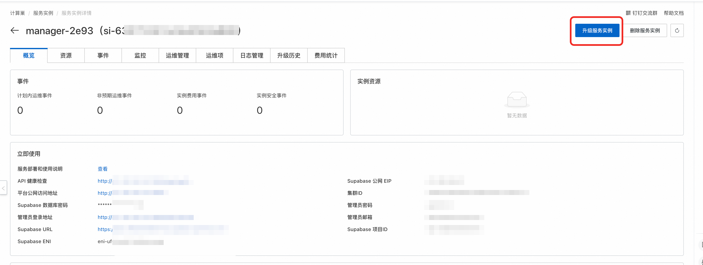

# 发布记录

本页汇总 Agent Manager 各版本的功能变化、问题修复和升级注意事项。

## 版本列表

| 版本 | 发布说明 |
| --- | --- |
| 1.0.7 | [v1.0.7](../release-notes/v1.0.7.md) |
| 1.0.6 | [v1.0.6](../release-notes/v1.0.6.md) |
| 1.0.5 | [v1.0.5](../release-notes/v1.0.5.md) |
| 1.0.4 | [v1.0.4](../release-notes/v1.0.4.md) |
| 1.0.3 | [v1.0.3](../release-notes/v1.0.3.md) |
| 1.0.2 | [v1.0.2](../release-notes/v1.0.2.md) |
| 1.0.1 | [v1.0.1](../release-notes/v1.0.1.md) |
| 1.0.0 | [v1.0.0](../release-notes/v1.0.0.md) |

## 升级计算巢服务实例

版本升级通过阿里云计算巢控制台完成。升级前先阅读目标版本的注意事项，并确认服务实例参数仍然适用。

1. 登录[阿里云计算巢控制台](https://computenest.console.aliyun.com/service/instance/cn-hangzhou)。
2. 在“服务实例管理”中找到目标 Agent Manager 服务实例。
3. 进入实例详情页，选择“升级服务实例”。
4. 选择目标版本，检查升级参数和变更内容后提交。
5. 等待 ROS 资源栈更新完成，再打开平台地址验证登录、实例列表和模型调用。

升级计算巢服务实例前，建议先阅读[数据库备份恢复操作指南](../更换Supabase数据库操作指南.md)。如果要备份或升级平台中正在运行的 Agent 实例，请分别阅读 [Agent 备份](../Agent备份.md) 和 [Agent 升级](../Agent升级.md)。

## 相关文档

- [返回文档首页](../index.md)
- [服务实例部署与计费](../服务实例部署与计费.md)
- [Agent 备份](../Agent备份.md)
- [Agent 升级](../Agent升级.md)
- [常见问题与排障](../常见问题与排障.md)
