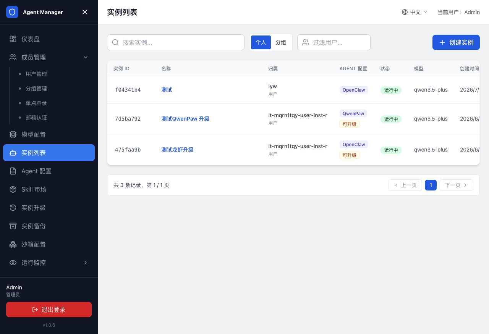
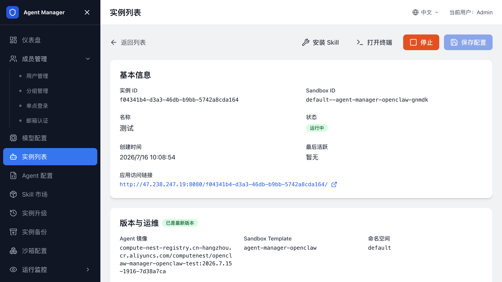
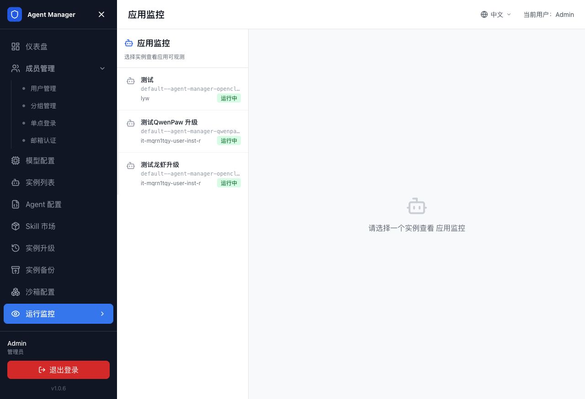

# 创建和管理 Agent 实例

本页面向平台管理员，介绍如何查看和管理 Agent 实例，以及如何确认用户侧实例是否正常运行。普通用户创建和使用自己的 Agent，请阅读[用户指南](用户指南.md)。

## 实例列表

登录用户中心后，打开 `实例列表` 页面查看您创建的 Agent 实例。

列表支持：

| 功能 | 说明 |
| --- | --- |
| 搜索 | 按实例名称搜索。 |
| 创建 | 单击创建实例进入创建页。 |
| 分页 | 每页展示固定数量实例，可翻页查看。 |
| 操作 | 查看详情、启动、停止、删除。 |

管理员还可以在管理后台查看全部用户的实例，并按用户过滤。

## 查看管理员仪表盘

管理员登录后可以在仪表盘查看用户数、实例数、可用模型和近期实例。启用 AI 网关和日志服务后，页面还会展示请求数、Token 用量和用户消耗排行，并提供跳转 AI 网关控制台的入口。

管理员在实例列表中还可以按用户筛选实例、查看实例详情，以及在已配置集群访问权限时跳转到容器服务控制台查看 Pod。

## 查看实例详情

打开实例列表中的目标实例，可以查看实例 ID、Sandbox ID、运行状态、应用访问链接、镜像和 Sandbox 模板，并进入 Skill、终端、配置保存等操作入口。

## 查看应用监控

管理员可以在管理后台查看运行中实例的应用监控，用于确认 Agent 应用是否已接入可观测能力。

1. 打开管理后台，进入 `运行监控 -> 应用监控`。
2. 在左侧选择状态为“运行中”的实例。
3. 等待监控面板加载；首次启用监控时，先在 Agent 应用中发起一次对话。
4. 如需单独打开监控页面，单击“新窗口打开”。

如果页面提示选择实例，先选择运行中的实例。如果提示监控资源未就绪，等待资源创建完成后刷新。仍然没有数据时，检查 Agent 类型是否启用了应用监控，并确认模型提供商满足对应的监控要求。

## 创建 Agent 实例

管理员可以从管理后台为自己或指定用户创建实例。用户侧创建流程和可见范围不同，请勿将本页的管理后台入口发给普通用户。

1. 打开用户中心。
2. 进入 `实例列表`。
3. 单击创建实例。
4. 选择 Agent 配置，例如 OpenClaw、Hermes 或 QwenPaw。
5. 填写实例名称。
6. 选择已启用的 AI 模型。
7. 按需选择消息渠道。
8. 如果页面显示自定义变量，按字段说明填写变量值。
9. 单击创建实例。

创建后，等待实例状态变为运行中。运行中表示沙箱环境、Agent 配置和 Agent 服务已经准备好，可以打开应用访问链接。

## 填写渠道配置

如果创建实例时选择了消息渠道，页面会展开渠道配置区域。

常见字段包括：

| 字段 | 说明 |
| --- | --- |
| Client ID | 对应 IM 平台应用的客户端 ID。 |
| Client Secret | 对应 IM 平台应用的密钥。 |
| Webhook 或 Token | 由具体 Agent 类型和渠道模板决定。 |

请从对应开放平台获取这些值，例如飞书开放平台、钉钉开放平台、企业微信管理后台或 QQ 开放平台。

## 打开 Agent 应用

1. 打开实例详情页。
2. 确认实例状态为运行中。
3. 在基本信息区域找到应用访问链接。
4. 单击链接，或单击在新窗口打开。
5. 在新页面使用 Agent 应用。

如果启用了 Agent 访问认证，应用访问链接会先进入 Agent 访问网关。网关会校验当前登录态和实例归属。

## 使用终端

如果当前 Agent 类型支持终端登录，应用访问页面会提供终端入口。

1. 打开实例应用访问链接。
2. 进入终端区域。
3. 等待终端连接完成。
4. 在终端中执行您的任务。

终端无法连接时，先确认实例仍处于运行中，并查看 [常见问题与排障](常见问题与排障.md) 中的 Agent 访问链接 502 和实例创建失败章节。

## 上传文件

支持文件上传的实例访问页面可一次选择多个文件。

1. 打开实例应用访问链接。
2. 单击上传文件。
3. 选择一个或多个文件，或将文件拖拽到上传区域。
4. 等待页面提示上传完成。
5. 再继续执行 Agent 任务。

上传大文件或大量文件时，耗时受网络和实例环境影响。请等待页面确认上传完成后再关闭页面。

## 修改实例模型

1. 打开实例详情页。
2. 在模型配置区域选择新的 AI 模型。
3. 确认页面出现已修改提示。
4. 单击保存配置。

保存后，实例会按 Agent 类型的配置规则更新配置。部分 Agent 需要重启进程后新模型才生效，具体行为由 Agent 类型配置决定。

## 修改实例渠道

1. 打开实例详情页。
2. 在渠道配置区域选择渠道类型。
3. 填写渠道所需字段。
4. 只修改非密钥字段时，保留 Client Secret 为空。
5. 单击保存配置。

Client Secret 输入框通常支持“留空则保持不变”。只有需要更换密钥时才填写新值。

## 停止实例

暂时不使用 Agent 时，停止实例以释放运行资源。

1. 打开实例列表。
2. 找到目标实例。
3. 单击停止。
4. 等待状态从停止中变为已停止。

停止后，实例配置和已保留的数据不会被删除。

## 重启实例

1. 打开实例列表。
2. 找到状态为已停止的实例。
3. 单击启动。
4. 等待状态从启动中变为运行中。

如果管理员修改了 SandboxSet，已运行实例通常需要停止再启动，才能应用新的沙箱配置。

## 删除实例

删除实例会移除实例记录并终止关联沙箱。删除前确认不再需要该实例中的数据。

1. 打开实例列表。
2. 找到目标实例。
3. 单击删除。
4. 在确认弹窗中确认删除。

删除操作不可恢复。

## 用户侧 Token 用量

如果管理员启用了 AI 网关和 Token 统计，用户实例列表顶部会显示 Token 用量概览，包括实例数量、今日 Token 用量和近 30 天 Token 用量。

进度条会根据使用率展示不同状态。达到限额后，用户的模型调用可能被限制。

## 备份

要保留实例数据或从备份创建新实例，请阅读 [Agent 备份](Agent备份.md)。

## 升级

要在更换镜像、启动命令或运行参数后迁移正在运行的 Sandbox，请阅读 [Agent 升级](Agent升级.md)。

## 相关文档

- [返回文档首页](index.md)
- [用户、登录和分组管理](用户登录与分组管理.md)
- [配置 Agent 类型](配置Agent类型.md)
- [配置沙箱（SandboxSet）](配置SandboxSet.md)
- [Agent 备份](Agent备份.md)
- [Agent 升级](Agent升级.md)
- [配置网关](配置网关.md)
- [Agent Manager 常见问题与排障](常见问题与排障.md)
