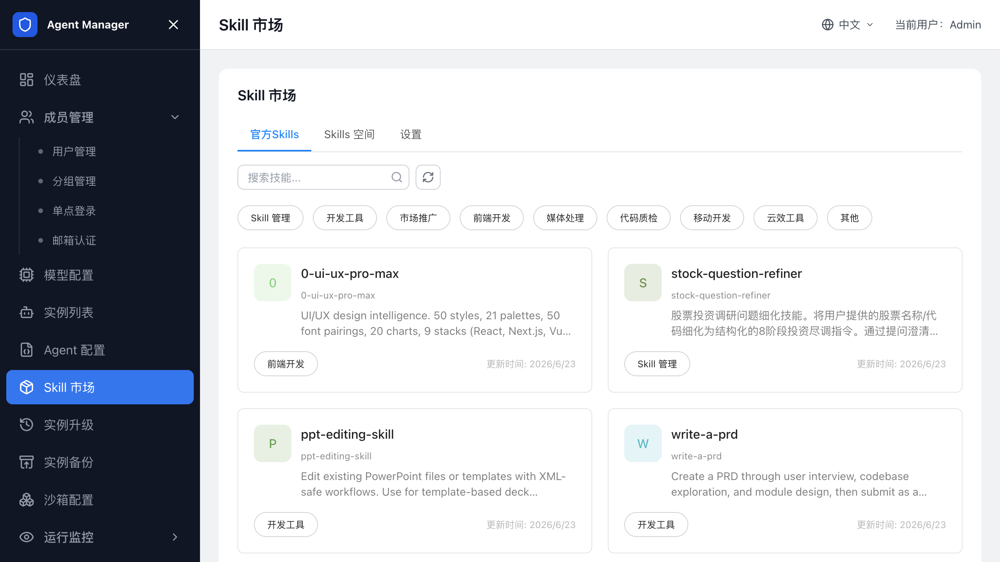

# 技能管理

在 `Skill 市场` 中管理 SkillHub、官方 Skill、企业自定义 Skill 空间和 Skill 沙箱挂载，让 Agent 使用工具或企业内部能力。

## SkillHub 配置

Agent 通过 SkillHub 查找和调用技能。进入 `Skill 市场` 后，先确认 SkillHub 已初始化，再查看官方 Skill、自定义 Skill 空间和配置状态。

首次使用前，确认：

- 计算巢部署参数中已配置 SkillHub 相关信息。
- 管理后台 `Skill 市场 -> 设置` 中显示 SkillHub 已初始化。
- SandboxSet 中已注入 Agent 运行时需要的 SkillHub 地址或环境变量。

如果 SkillHub 未初始化，自定义 Skill 空间可能无法创建或浏览。

## 查看官方 Skill

如果只是验证 Agent 能否调用工具，先从官方 Skill 开始。

1. 登录管理后台。
2. 打开 `Skill 市场`。
3. 进入官方 Skill 标签页。
4. 通过关键字或标签筛选 Skill。
5. 打开 Skill 详情查看说明、参数和使用范围。

需要做企业内部调整时，先把官方 Skill 克隆到自定义 Skill 空间，再维护企业版本。

## 管理自定义 Skill 空间

自定义 Skill 空间用于管理企业内部 Skill。

1. 打开 `Skill 市场`。
2. 进入自定义 Skill 空间标签页。
3. 单击创建 Skill 空间。
4. 填写名称和说明。
5. 保存后进入空间详情。

创建后，在空间中维护企业内部 Skill。不同 Skill 空间可按团队、业务线或环境区分。

## 创建或上传自定义 Skill

在自定义 Skill 空间中，创建企业内部 Skill 或上传 Skill ZIP 包。

1. 打开 `Skill 市场`。
2. 进入目标自定义 Skill 空间。
3. 单击创建 Skill。
4. 选择创建方式。
5. 填写 Skill 名称、说明和标签。
6. 如果选择上传文件，上传符合规范的 ZIP 包。
7. 等待安全检测完成。
8. 检测通过后保存 Skill。

上传包中应包含 `SKILL.md`，依赖文件放在清晰的子目录中。安全检测不通过时，根据页面提示移除高风险文件、异常脚本或不符合规范的内容后重新上传。

## 克隆官方 Skill

基于官方 Skill 扩展企业版本时，把官方 Skill 克隆到自定义空间。

1. 在官方 Skill 列表中找到目标 Skill。
2. 单击克隆。
3. 选择目标自定义 Skill 空间。
4. 确认克隆。
5. 进入自定义空间查看克隆结果。

克隆后请检查 Skill 依赖、参数和权限要求，再让 Agent 类型或实例使用。

## 查看和维护 Skill 文件

Skill 详情页展示 Skill 基本信息和文件列表。管理员按企业变更流程更新 Skill 描述、标签和文件内容。

维护时注意：

- 修改 Skill 后，已运行实例不一定自动加载最新文件。
- 如果 Skill 通过 SandboxSet 挂载到沙箱，需要重建或升级实例后才能稳定生效。
- 删除 Skill 前，确认没有 Agent 类型或实例仍依赖该 Skill 空间。

## 配置 Skill 沙箱挂载

Agent 运行时需要在沙箱内读取 Skill 文件时，请在 SandboxSet 中配置 Skill 挂载。管理后台的 Skill 配置会生成挂载配置预览，实际生效依赖 SandboxSet。

配置时确认：

- 挂载路径使用绝对路径。
- 不要把 Skill 挂载到 Agent 工作目录或运行时状态目录。
- OSS 子路径和 Skill 空间目录一致。
- 修改 SandboxSet 后，新建或重建实例才能自动获得新挂载。

如果已有实例需要使用新的 Skill 挂载，请停止并重新启动实例，或通过 [Agent 升级](Agent升级.md) 将实例迁移到新的 SandboxSet 模板。

## 排查 Skill 不可用

如果 Agent 无法找到或调用 Skill，请按以下顺序检查：

1. SkillHub 配置是否已初始化。
2. Skill 是否存在于官方 Skill 或自定义 Skill 空间中。
3. SandboxSet 环境变量是否包含正确的 SkillHub 地址。
4. Skill 挂载路径是否存在，且 Agent 运行用户有读取权限。
5. 已运行实例是否需要重启或升级后才能应用新的 SandboxSet。

## 相关文档

- [返回文档首页](index.md)
- [配置 Agent 类型](配置Agent类型.md)
- [配置沙箱（SandboxSet）](配置SandboxSet.md)
- [创建和管理 Agent 实例](创建和管理Agent实例.md)
- [Agent 备份](Agent备份.md)
- [Agent 升级](Agent升级.md)
- [Agent Manager 常见问题与排障](常见问题与排障.md)
