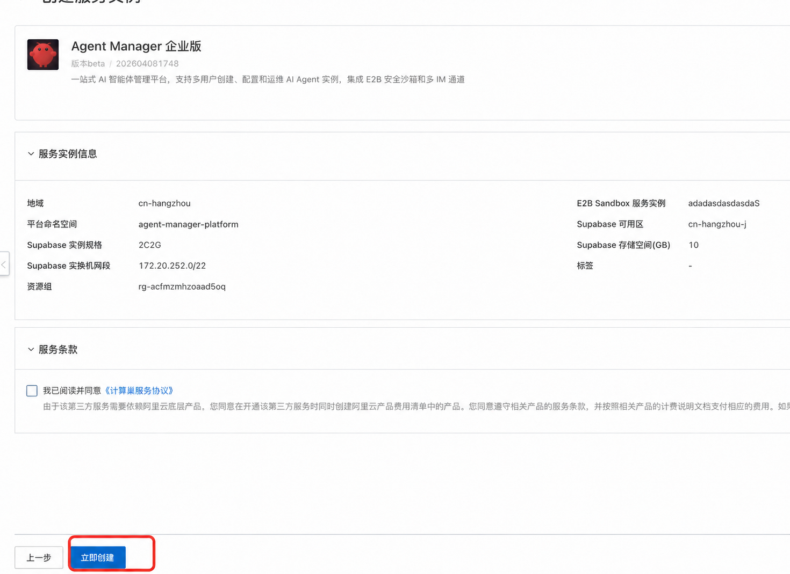

# Agent Manager 服务实例部署与计费

本页说明如何在阿里云计算巢创建 Agent Manager 服务实例。部署前确认费用、前提条件、权限和参数；部署完成后按本页验证平台地址和管理员入口。

## 服务说明

部署完成后，使用服务实例输出的管理员地址完成初始化。随后配置用户、模型、Agent 类型、沙箱配置和 Token 限流。

用户创建 Agent 实例后，通过实例详情页的“进入工作台”使用 Agent 原生界面。

服务通过计算巢和 ROS 模板部署到已有 ACS/ACK Sandbox 集群中。

部署过程会创建或接入 Supabase，部署 Agent Manager 工作负载、OSS 存储和可选的阿里云 AI 网关。

## 计费说明

Agent Manager 服务实例通过计算巢编排云资源。实际费用以创建服务实例页面和订单确认页面的实时价格为准。

创建服务实例前，重点确认以下费用来源：

| 资源 | 何时产生费用 |
| --- | --- |
| ACS/ACK Sandbox 集群 | 已有 Sandbox 集群的计算、网络和存储费用。 |
| Supabase | 选择“新建阿里云托管 Supabase”时产生数据库规格、存储和公网 EIP 等费用。 |
| 负载均衡 | Agent Manager 平台公网入口使用的负载均衡资源。 |
| OSS | 备份 OSS 和 SkillHub OSS 中的备份数据、用户 Skill 产生的存储及请求费用。 |
| 阿里云 AI 网关 | 选择“是否配置 AI 网关”为“是”时产生网关规格和公网流量费用。 |
| 日志、监控和网络流量 | 使用日志、监控、公网带宽或 CDT 时按对应产品计费。 |

提交订单前，确认账户余额、资源配额和目标地域库存。使用 RAM 用户部署时，确认 RAM 权限已满足本页要求。

## 部署架构

部署完成后，访问链路如下：

```text
浏览器
  -> 平台公网 SLB
  -> Agent Manager 前端和 API
  -> Supabase / E2B Sandbox / OSS / AI Gateway
```

Agent 原生界面通过 Agent Manager 的 `8080` 入口访问。Manager 校验当前登录用户和实例权限后，在服务端代理到 VPC 内的 E2B Sandbox；浏览器无需访问 E2B 域名。

## 前提条件

### 已准备 Sandbox 集群

部署 Agent Manager 前，需要先准备一个 OpenClaw-ACS-Sandbox 集群版服务实例。

- 国内站：[创建 OpenClaw-ACS-Sandbox 集群版实例](https://computenest.console.aliyun.com/service/instance/create/cn-hangzhou?type=user&ServiceId=service-56531b838b524f5a83da)
- 国际站：[创建 OpenClaw-ACS-Sandbox 集群版实例](https://computenest.console.aliyun.com/service/instance/create/ap-southeast-1?type=user&ServiceId=service-731298a621304868a3a4)

部署页面中的 `Sandbox 集群 ID` 要选择该 Sandbox 所在的 K8s 集群。

### 已确认网络和交换机

如果选择新建阿里云托管 Supabase，请选择集群管控交换机或对应可用区的新交换机。不要选择 OpenClaw 专属交换机。

如果使用已有开源 Supabase，请提前准备浏览器访问 URL、服务端访问 URL、Anon Key、Service Role Key 和数据库连接串。

### 已准备模型调用方式

模型可在部署后配置。需要部署时自动接入阿里云 AI 网关时，提前准备 DashScope API Key、网关规格和网络类型。

如果部署时启用 AI 网关，请提前从百炼控制台获取 DashScope API Key，并确认该 Key 不会写入公开工单、聊天记录或代码仓库。

## RAM 权限

创建服务实例的 RAM 用户或角色，必须具备计算巢服务实例创建权限，以及模板涉及的 ROS、CS、VPC、ECS、OSS 和可选 AI 网关资源的操作权限。具体权限以计算巢创建页的校验结果为准。

| 权限范围 | 用途 |
| --- | --- |
| 计算巢、ROS | 创建和更新服务实例及资源栈。 |
| CS、VPC、ECS | 选择集群、VPC、交换机，并创建模板需要的网络资源。 |
| OSS | 创建或使用备份 OSS，并访问用于存储用户 Skill 的 SkillHub OSS。 |
| APIG、日志、监控 | 仅在启用阿里云 AI 网关或相关监控能力时需要。 |

模板中的“阿里云访问凭证来源”用于平台访问 OSS、SkillHub、AI 网关等资源，不等同于创建服务实例的 RAM 用户权限。选择“使用已有 AccessKey”时，按页面显示的“已有 AccessKey 权限策略参考”给对应 RAM 用户或角色授权。不要直接把 AccessKey 写入文档、代码仓库或聊天记录。

## 部署流程

### 步骤一：进入服务实例创建页

1. 登录阿里云计算巢控制台。
2. 搜索并打开“Agent Manager”服务。
3. 单击开始部署或正式创建，进入创建服务实例页面。

也可以在服务目录中搜索 Agent Manager。服务卡片提供详情页、部署文档和服务实例创建入口。

### 步骤二：填写前置确认

阅读白名单配置确认说明，并勾选确认框。实例升级和 Skill 挂载依赖 Agent Sandbox 共享存储；启用前确认已评估特权容器和 hostPath 带来的安全责任。

### 步骤三：填写 Sandbox 配置

1. 在 `Sandbox 集群 ID`（`ClusterId`）中选择已有 ACS Sandbox 所在 K8s 集群。
2. 在 `K8s 命名空间`（`PlatformNamespaceName`）中填写平台命名空间，默认是 `openclaw-platform`。

没有可选集群时，先创建 OpenClaw-ACS-Sandbox 集群版服务实例。

### 步骤四：填写 Supabase 配置

在 `Supabase 来源`（`SupabaseDeploymentMode`）中，生产环境推荐选择 `CreateNew`（新建阿里云托管 Supabase）。

选择 `UseExistingOpenSource`（使用已有开源 Supabase）时，填写已有 Supabase 的公网 URL、服务端访问 URL、Anon Key、Service Role Key 和数据库连接串。此模式适用于兼容性验证、迁移或测试，不建议用于生产环境。

数据库连接串中的密码如果包含 `@`、`#`、`%` 等特殊字符，先做 URL 编码。

选择 Supabase 所在可用区（`ZoneId`）、VPC（`VpcId`）和交换机（`VSwitchId`）。

如果选择新建阿里云托管 Supabase，请使用集群管控交换机或对应可用区的普通交换机，不要选择 OpenClaw 专属交换机。

### 步骤五：填写 OSS、SkillHub、AI 网关和访问凭证

1. 在 `选择已有/新建的OSS存储桶`（`OssOption`）中选择新建或复用备份 OSS Bucket。
2. 确认 `SkillHub OSS 配置`（`SkillHubConfig`）已自动加载。该 OSS 用于存储用户 Skill。
3. 如果要在部署时启用阿里云 AI 网关，把 `是否配置 AI 网关`（`EnableAIGateway`）设为 `Yes`，填写 DashScope API Key，并选择网关规格和网络访问类型。
4. 在 `阿里云访问凭证来源`（`AccessKeyMode`）中选择自动创建 AccessKey 或使用已有 AccessKey。

### 步骤六：确认订单并创建

1. 检查右侧参数完成度和询价明细。
2. 单击下一步：确认订单。
3. 勾选计算巢服务协议。
4. 单击立即创建。

部署通常需要 5 到 10 分钟。部署期间，在服务实例详情页查看状态、资源和部署日志。



## 常见部署问题

| 现象 | 处理方式 |
| --- | --- |
| 提示网段冲突 | 检查 Supabase 交换机网段是否与 VPC 已有网段重叠，更换不冲突的交换机。 |
| 部署长时间未完成 | 在计算巢服务实例详情页查看部署事件和日志；Supabase 创建可能需要更长时间。 |
| 平台页面无法访问 | 等待 ALB/Ingress 就绪后重试，并检查集群中的 Ingress 资源。 |
| 登录后提示数据库连接失败 | 等待 Supabase 进入运行中，确认 URL、Service Role Key 和数据库连接串属于同一个实例。 |
| 开源 Supabase 的 Site URL 或邮箱认证保存返回 501 | 使用 [用户、登录和分组管理](用户登录与分组管理.md) 中的 `kubectl set env` 方式配置 GoTrue。 |

## GlobalTrafficPolicy 网络策略

如果集群使用 `GlobalTrafficPolicy` 对 Agent Pod 做网络隔离，必须确认 `spec.selector.matchLabels` 能匹配 SandboxSet 创建的 Pod。新增 Agent 类型或修改 SandboxSet 标签后，需要重新检查 selector。

```bash
kubectl edit globaltrafficpolicy openclaw-global-policy
```

例如，策略需要匹配 OpenClaw Pod 时：

```yaml
spec:
  selector:
    matchLabels:
      app: agent-manager-openclaw
```

相同网络规则可以扩展现有 selector；不同网络规则应新建独立的 `GlobalTrafficPolicy`。策略生效后，验证 Agent Manager 和 Sandbox 之间的必要链路仍然可达。

## 部署参数说明

### 前置确认

| 参数 | 模板字段 | 默认值 | 说明 |
| --- | --- | --- | --- |
| 白名单配置确认 | `WhitelistConfirmation` | 未勾选 | 确认已阅读 Agent Sandbox 共享存储、特权容器和 hostPath 相关说明。必须勾选后才能部署。 |

### Sandbox 配置

| 参数 | 模板字段 | 默认值 | 说明 |
| --- | --- | --- | --- |
| Sandbox 集群 ID | `ClusterId` | 无 | 选择已有 ACS Sandbox 所在的 K8s 集群。 |
| K8s 命名空间 | `PlatformNamespaceName` | `openclaw-platform` | Agent Manager 平台资源所在命名空间。 |

### Supabase 配置

| 参数 | 模板字段 | 默认值 | 说明 |
| --- | --- | --- | --- |
| Supabase 来源 | `SupabaseDeploymentMode` | `CreateNew` | 生产环境使用托管 Supabase。已有开源 Supabase 仅用于兼容、迁移或测试。 |
| Supabase 实例规格 | `SupabaseProjectSpec` | `2C2G` | 新建托管 Supabase 时填写。 |
| Supabase 存储空间(GB) | `SupabaseStorageSize` | `10` | 新建托管 Supabase 时填写，最小值为 1 GB。 |
| 已有 Supabase 公网 URL | `ExistingSupabaseUrl` | 空 | 使用已有开源 Supabase 时填写，供浏览器访问，不要以 `/` 结尾。 |
| 已有 Supabase 服务端访问 URL | `ExistingSupabaseInternalUrl` | 空 | 使用已有开源 Supabase 时填写，供后端访问。相同集群内可填写 K8s Service 地址。 |
| 已有 Supabase Anon Key | `ExistingSupabaseAnonKey` | 空 | 使用已有开源 Supabase 时填写，供前端调用 Auth/REST API。 |
| 已有 Supabase Service Role Key | `ExistingSupabaseServiceRoleKey` | 空 | 使用已有开源 Supabase 时填写，仅服务端使用。 |
| 已有 Supabase 数据库连接串 | `ExistingSupabaseDatabaseUrl` | 空 | 使用已有开源 Supabase 时填写，用于初始化表结构和管理员账号。 |
| Supabase 可用区 | `ZoneId` | 空 | 新建托管 Supabase 时选择。 |
| 专有网络 VPC 实例 ID | `VpcId` | 空 | 新建托管 Supabase 时选择，通常与 Sandbox 集群在同一 VPC。 |
| 交换机实例 ID | `VSwitchId` | 空 | 新建托管 Supabase 时选择。不要选择 OpenClaw 专属交换机。 |

### OSS 存储配置

| 参数 | 模板字段 | 默认值 | 说明 |
| --- | --- | --- | --- |
| 选择已有/新建的 OSS 存储桶 | `OssOption` | `NewOSS` | 存储 Agent 备份数据。 |
| OSS 存储桶名称 | `ExistingBucketName` | 空 | 选择已有 OSS Bucket 时必填。 |

### SkillHub OSS 配置

| 参数 | 模板字段 | 默认值 | 说明 |
| --- | --- | --- | --- |
| SkillHub OSS 配置 | `SkillHubConfig` | 自动获取 | 自动加载用于存储用户 Skill 的 SkillHub OSS。 |

### AI 网关配置

| 参数 | 模板字段 | 默认值 | 说明 |
| --- | --- | --- | --- |
| 是否配置 AI 网关 | `EnableAIGateway` | `No` | 选择 `Yes` 会自动创建阿里云 AI 网关和百炼模型代理。 |
| DashScope API Key | `DashScopeApiKey` | 空 | 启用 AI 网关时填写，从百炼控制台获取。 |
| AI 网关规格 | `AIGatewaySpec` | `aigw.small.x1` | 规格越高，支持的并发请求越多。 |
| AI 网关网络访问类型 | `AIGatewayNetworkType` | `InternetAndIntranet` | 可选择公网、内网或公网+内网。公网访问会产生公网流量费用。 |

### 云资源访问凭证

| 参数 | 模板字段 | 默认值 | 说明 |
| --- | --- | --- | --- |
| 阿里云访问凭证来源 | `AccessKeyMode` | `AutoCreate` | 用于平台访问 OSS、AI 网关等云资源。 |
| 已有 AccessKey 权限策略参考 | `ExistingAccessKeyRequiredPolicy` | 自动展示 | 选择已有 AccessKey 时按此策略授权。 |
| 已有 AccessKey ID | `ExistingAccessKeyId` | 空 | 选择已有 AccessKey 时填写。 |
| 已有 AccessKey Secret | `ExistingAccessKeySecret` | 空 | 选择已有 AccessKey 时填写。 |

## 验证结果

### 查看服务实例状态

1. 打开计算巢控制台。
2. 进入服务实例管理。
3. 找到 Agent Manager 服务实例。
4. 确认状态为已部署。

状态长时间停留在部署中时，先查看服务实例详情页的部署日志。

### 获取平台访问地址

部署完成后，在服务实例输出中查看以下地址：

| 输出项 | 用途 |
| --- | --- |
| 平台公网访问地址（`PlatformUrl`） | 打开 Agent Manager 平台首页。 |
| 管理员登录地址（`AdminLoginUrl`） | 进入管理员登录页。 |
| API 健康检查（`ApiHealthUrl`） | 检查后端 API 是否正常。 |
| OAuth App 回调地址（`SupabaseOAuthCallbackUrl`） | 配置 OAuth Provider 时使用。 |
| SAML SP Metadata 地址（`SupabaseSamlMetadataUrl`） | 配置 SAML 身份提供商时使用。 |
| SAML ACS 地址（`SupabaseSamlAcsUrl`） | 配置 SAML 身份提供商时使用。 |

打开 `API 健康检查` 地址。如果返回健康状态，说明平台 API 已启动。

### 获取初始管理员账号

服务实例输出中包含初始管理员信息：

| 输出项 | 默认值 |
| --- | --- |
| 管理员邮箱 | `admin@openclaw.local` |
| 管理员密码 | `admin123` |

首次登录后请立即修改管理员密码。

## 后续步骤

- 完成首次登录、分组管理和第一个实例创建：阅读 [用户、登录和分组管理](用户登录与分组管理.md) 和 [创建和管理 Agent 实例](创建和管理Agent实例.md)。
- 配置 Agent 类型、沙箱和模型网关：阅读 [配置 Agent 类型](配置Agent类型.md)、[配置沙箱（SandboxSet）](配置SandboxSet.md) 和 [配置网关](配置网关.md)。
- 配置 Agent 实例备份：阅读 [Agent 备份](Agent备份.md)。
- 配置已运行 Agent 的沙箱升级：阅读 [Agent 升级](Agent升级.md)。
- 遇到部署或访问问题：阅读 [常见问题与排障](常见问题与排障.md)。

## 相关文档

- [返回文档首页](index.md)
- [发布记录](release-notes/README.md)
- [Agent 备份](Agent备份.md)
- [Agent 升级](Agent升级.md)
- [Agent Manager 常见问题与排障](常见问题与排障.md)
- [数据库备份恢复操作指南](更换Supabase数据库操作指南.md)
