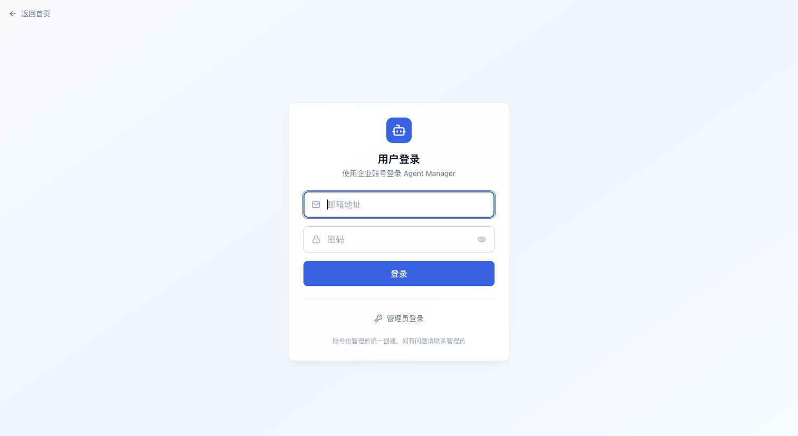
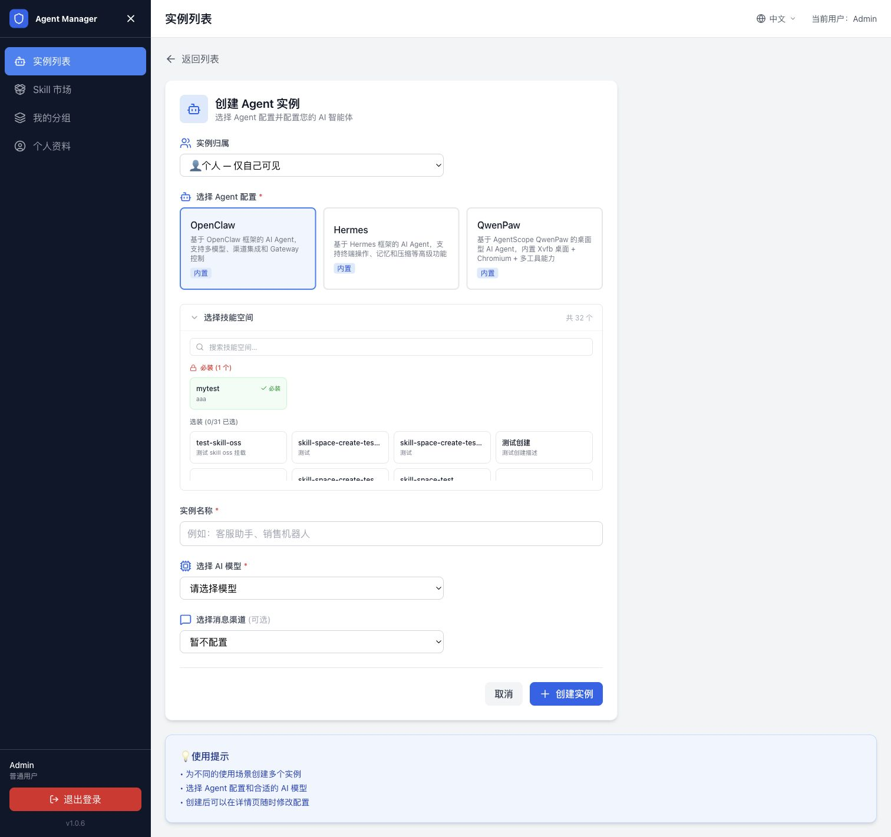
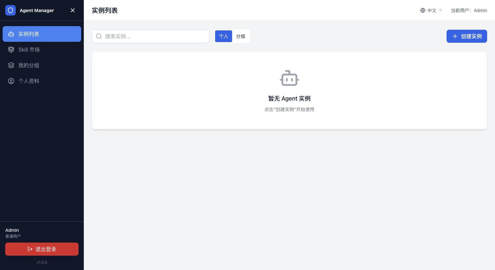
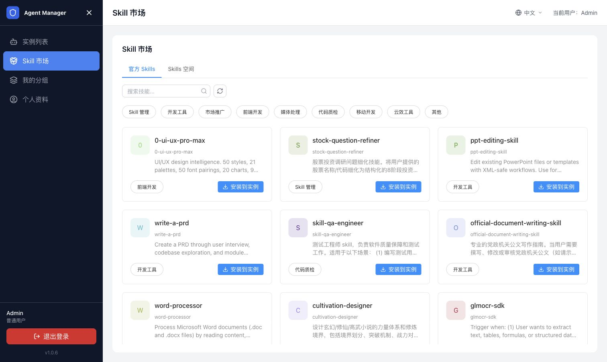
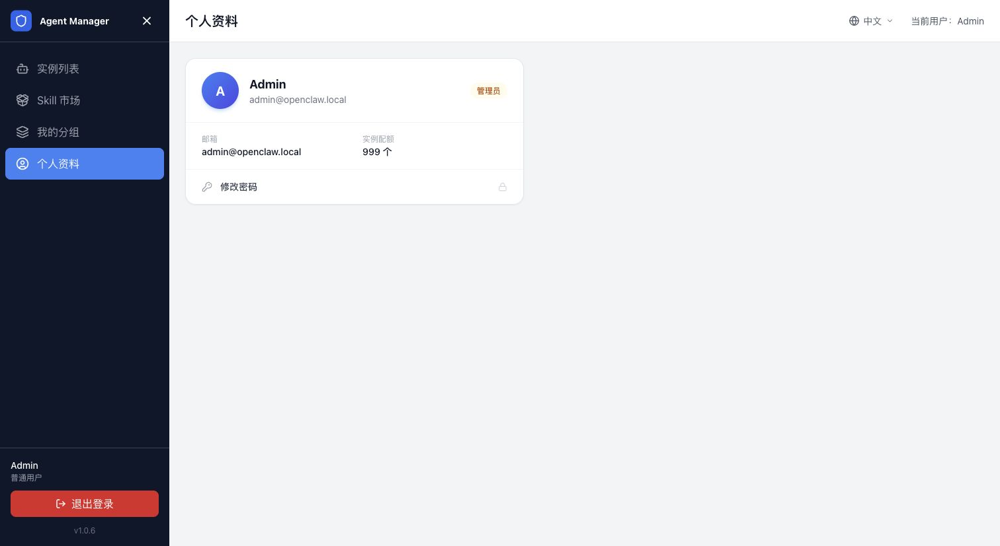
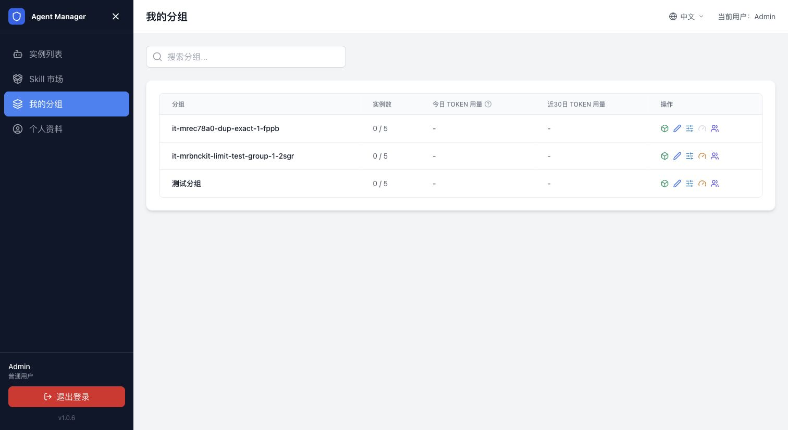

# 用户指南

本指南面向管理员创建的普通用户，介绍如何登录用户工作台并使用 Agent。您不需要进入管理后台；如果页面没有显示某项配置或操作，说明该功能需要管理员先开放。

## 使用前确认

开始前，请向管理员确认以下信息：

- 平台访问地址和登录方式。
- 已为您创建的账号，或允许使用的企业单点登录方式。
- 可使用的 Agent 配置、模型和消息渠道。
- 个人或分组的实例配额，以及是否有 Token 或预算限制。

## 登录与首次使用

1. 打开平台访问地址，进入用户登录页。
2. 使用管理员提供的邮箱密码、OAuth 或 SAML SSO 方式登录。
3. 登录成功后进入用户工作台的“实例列表”页面。
4. 如果管理员要求首次登录修改密码，先完成密码修改，再返回用户侧。

用户侧左侧导航包含以下入口：

| 入口 | 用途 |
| --- | --- |
| 实例列表 | 创建、访问和管理自己的 Agent 实例。 |
| Skill 市场 | 浏览可用 Skill，并将 Skill 安装到已有实例。 |
| 我的分组 | 查看管理员分配给您的分组和分组实例。 |
| 个人资料 | 查看账号、实例配额和 Token 用量，修改密码。 |

## 创建和使用 Agent

### 创建实例

1. 打开左侧导航中的“实例列表”，单击“创建实例”。
2. 选择实例归属：选择“个人”表示只有自己可见；选择分组表示由分组成员共同使用。
3. 选择管理员已经配置好的 Agent 配置。
4. 在技能空间中选择需要的 Skill；标记为必装的 Skill 会自动加入实例。
5. 填写实例名称。
6. 选择可用的 AI 模型；如果管理员没有开放模型，联系管理员处理。
7. 按需选择消息渠道并填写渠道配置。
8. 单击“创建实例”，等待实例状态变为“运行中”。

创建实例页面展示的 Agent 配置、Skill、模型和渠道，均由管理员预先配置。用户只能从可用选项中选择，不能修改平台级配置。

### 打开 Agent 应用

1. 返回“实例列表”，找到状态为“运行中”的实例。
2. 打开实例详情。
3. 在详情页找到应用访问链接，单击链接或选择在新窗口打开。
4. 在 Agent 应用中开始对话或执行任务。

如果实例仍处于创建中，请等待状态更新后再打开链接。访问链接返回 502 时，先回到实例列表确认实例状态，再联系管理员排查沙箱和网关。

### 上传文件

如果 Agent 应用提供文件上传入口：

1. 打开 Agent 应用。
2. 单击上传文件，选择一个或多个文件，或将文件拖到上传区域。
3. 等待页面提示上传完成。
4. 再向 Agent 描述需要处理的文件和任务。

上传大文件或多个文件时，请等上传完成后再关闭页面。文件无法上传时，先检查文件大小、网络连接和实例运行状态。

### 使用终端

部分 Agent 配置会开放终端入口。打开 Agent 应用后进入终端，等待连接完成，再执行任务。终端是否可用由管理员在 Agent 配置中决定；未看到终端入口时无需重复刷新，请联系管理员确认。

## 管理我的实例

### 查看和筛选实例

在“实例列表”中：

- 使用搜索框按实例名称查找。
- 选择“个人”查看自己创建的实例。
- 选择“分组”查看您有权限使用的分组实例。
- 打开实例详情查看状态、访问链接、模型、渠道和运行配置。

### 启动、停止和删除

您可以根据页面显示的权限执行以下操作：

1. 在实例列表中找到目标实例。
2. 选择“启动”或“停止”，等待状态变为“运行中”或“已停止”。
3. 确认不再需要实例及其中数据后，再选择“删除”。

停止实例会暂停运行资源，通常不会删除实例配置；删除实例会终止关联沙箱并移除实例记录，删除前请确认数据已经备份。

### 修改实例配置

如果管理员在 Agent 类型中开放了修改能力，您可以在实例详情中：

- 修改可用模型并保存配置。
- 修改消息渠道和渠道参数并保存配置。
- 按页面提示重启实例，使新配置生效。

如果看不到模型或渠道配置，或者保存按钮不可用，说明当前 Agent 配置不允许用户修改，需要联系管理员。

## 使用 Skill 市场

1. 打开左侧“Skill 市场”。
2. 在“官方 Skills”或“Skills 空间”中搜索 Skill，也可以按分类筛选。
3. 确认 Skill 的用途和适用场景。
4. 单击“安装到实例”，选择目标实例并确认。
5. 返回实例应用，按 Skill 的说明使用对应能力。

Skill 是否能安装到某个实例取决于实例状态、Skill 要求和您的权限。安装失败时，先确认目标实例正在运行，再查看错误提示。

## 查看个人资料和用量

### 查看账号和配额

打开“个人资料”，可以查看登录邮箱、账号角色和实例配额。需要修改密码时，从个人资料页进入修改密码流程。

### 查看 Token 用量

实例列表或个人资料页可能展示今日和近 30 天 Token 用量。实际显示内容取决于管理员是否配置 AI 网关和用量统计。

达到个人或分组限额后，模型调用可能被限制。此时请联系管理员确认限额和网关配置，不要重复创建实例。

### 使用分组实例

打开“我的分组”查看管理员分配的分组、实例数量和用量信息。

分组实例由分组成员共同使用。您能执行的操作由分组角色和实例权限决定；看不到目标分组或实例时，请联系分组管理员确认成员关系。

## 用户侧常见问题

### 登录后看不到实例列表怎么办

退出当前账号后重新打开平台访问地址，使用普通用户账号登录。不要使用计算巢服务实例输出中的“管理员登录地址”。如果仍然无法进入，检查账号是否已由管理员创建、账号状态是否启用，以及登录方式是否正确。

### 创建实例按钮不可用怎么办

通常是实例配额已用满，或者管理员还没有配置可用的 Agent 类型、模型或沙箱。记录页面提示后联系管理员处理。

### 实例长时间停留在创建中怎么办

不要连续重复创建。返回实例列表记录实例名称和状态，等待一段时间；仍未变为“运行中”时，将实例 ID 和页面提示提供给管理员排查。

### 应用访问链接打不开怎么办

先确认实例状态为“运行中”，再刷新实例详情页获取最新链接。若返回 502、超时或提示无权限，请联系管理员检查沙箱、网关和访问域名配置。

### 模型或渠道选项为空怎么办

这些选项由管理员配置并控制是否允许用户修改。请联系管理员确认模型提供商、AI 网关和渠道模板是否已启用。

### 文件上传失败怎么办

检查文件大小、文件格式和网络连接；确认实例仍在运行，并等待页面提示上传完成。持续失败时，记录文件类型、大小和错误提示，交给管理员排查。

### Skill 安装失败怎么办

确认目标实例正在运行，且您有权限使用该 Skill。仍然失败时，记录 Skill 名称、目标实例和错误提示，联系管理员处理。

## 相关文档

- [返回文档首页](index.md)
- [管理员指南：用户、登录和分组管理](用户登录与分组管理.md)
- [管理员指南：创建和管理 Agent 实例](创建和管理Agent实例.md)
- [管理员指南：技能管理](技能管理.md)
- [常见问题与排障](常见问题与排障.md)
