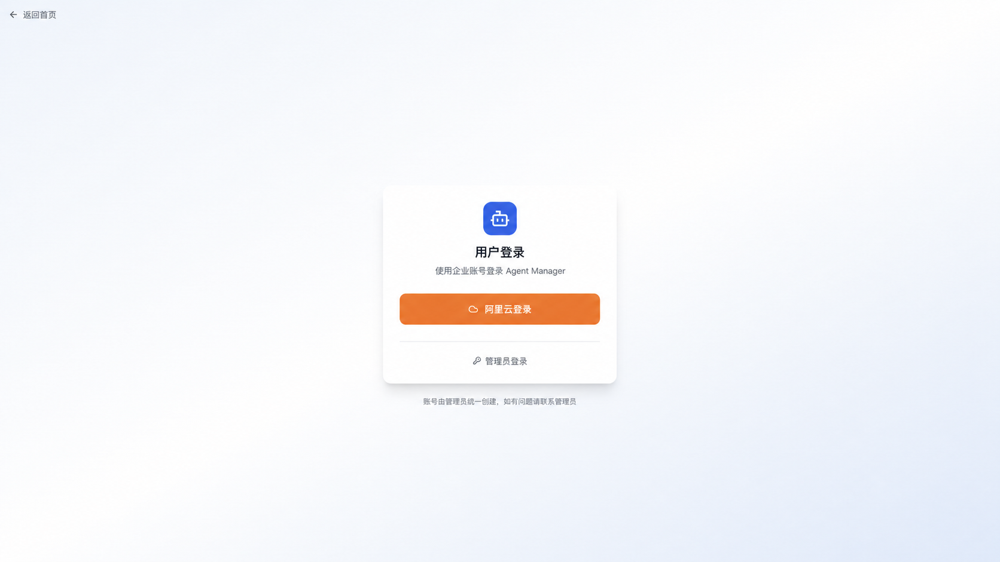
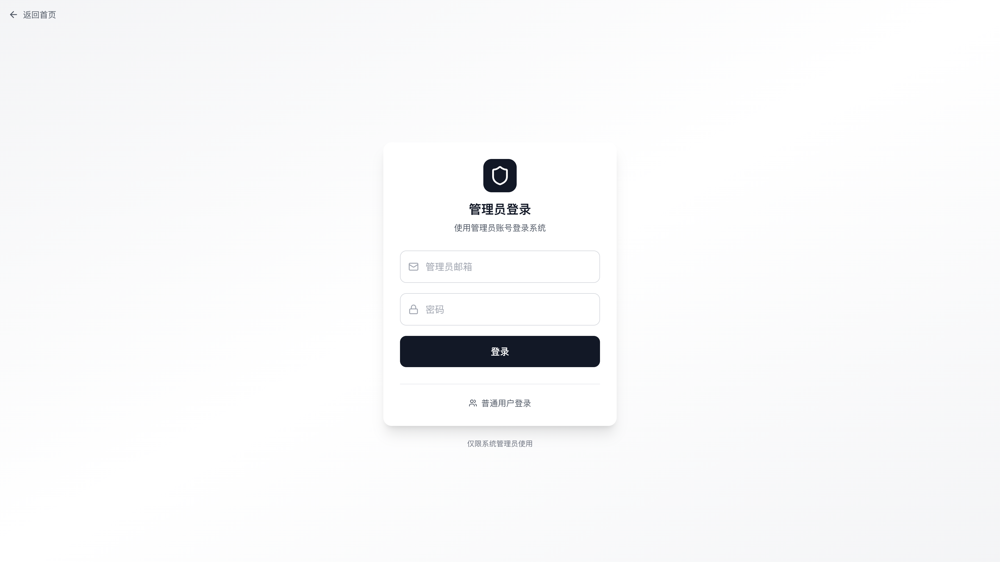
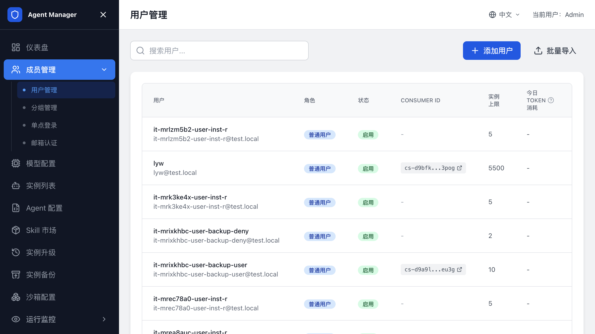
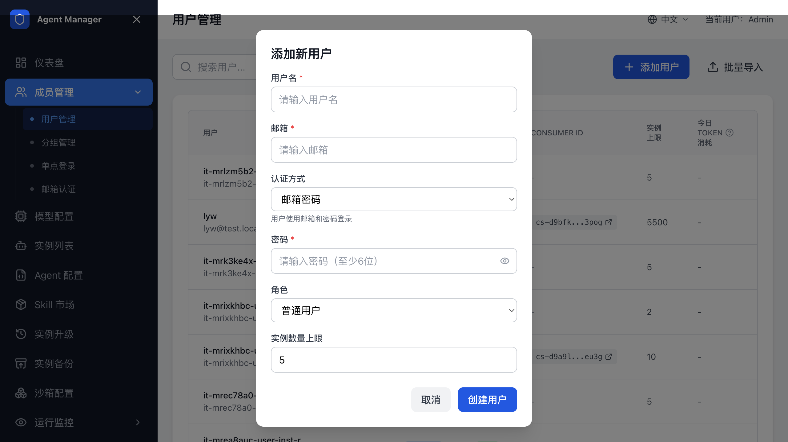
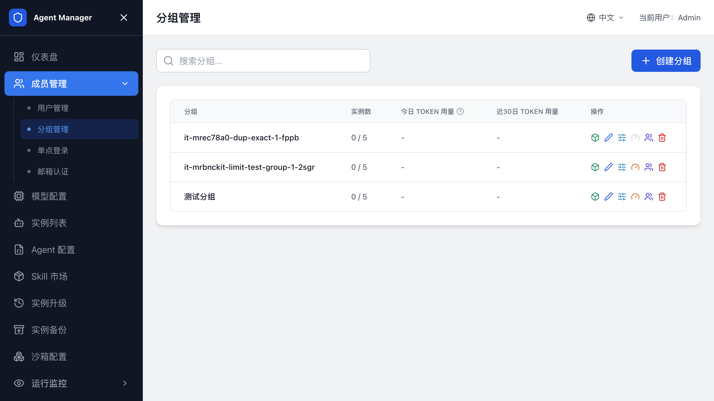
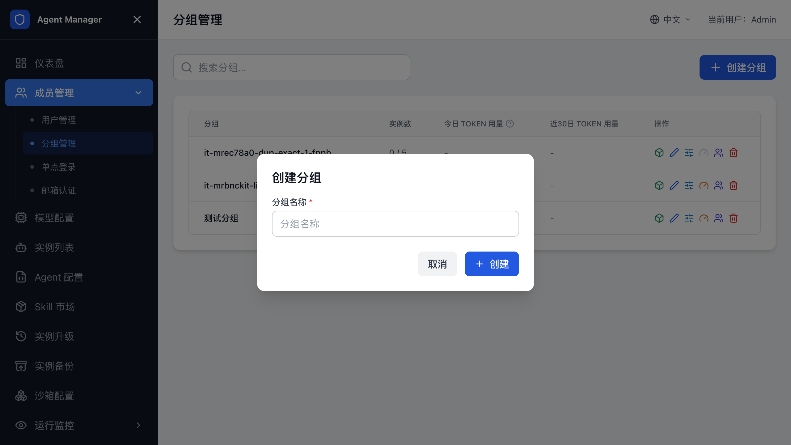
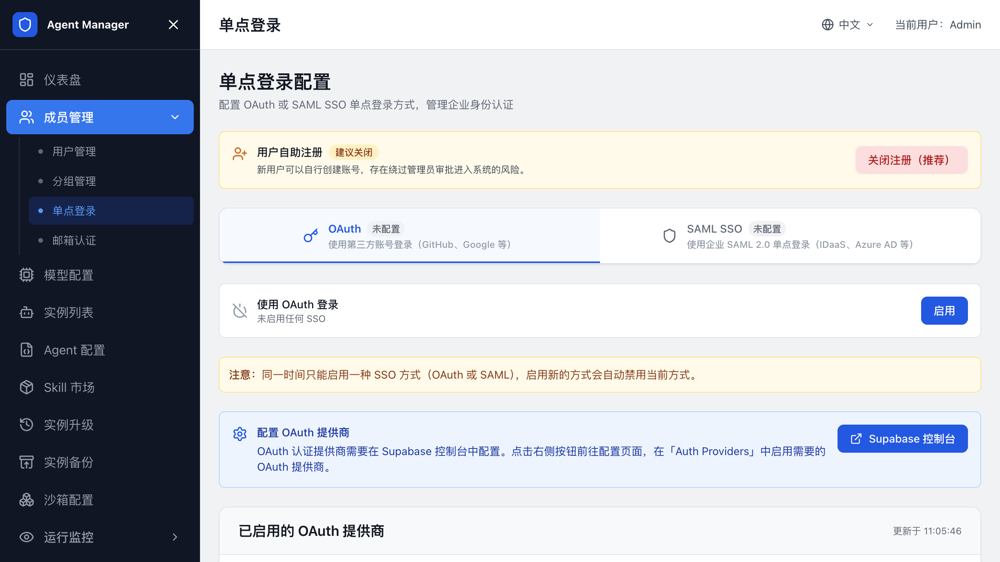
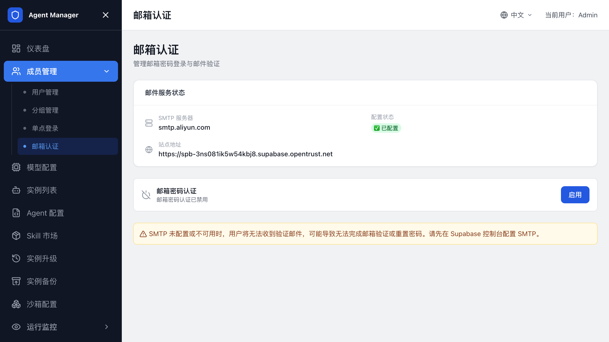

# 用户、登录和分组管理

本页面向平台管理员，介绍如何配置团队登录方式、创建用户和分组。普通用户登录后如何使用 Agent，请阅读[用户指南](用户指南.md)。

## 角色和入口

先确认您使用的是哪个入口：

| 角色 | 入口 | 能做什么 |
| --- | --- | --- |
| 管理员 | 计算巢服务实例输出中的“管理员登录地址” | 管理用户、分组、模型、Agent 类型、沙箱配置、AI 网关、Token 限流和全部实例。 |
| 普通用户 | 平台访问地址的登录页 | 创建和管理自己的 Agent 实例，查看个人资料和用量。具体使用方法见[用户指南](用户指南.md)。 |

未登录时直接访问用户页可能看到 404。先从登录页完成登录。



## 管理员首次登录

1. 在计算巢服务实例输出中复制 `管理员登录地址`。
2. 打开管理员登录地址。
3. 使用服务实例输出中的管理员邮箱和管理员密码登录。
4. 登录成功后进入管理后台。



当前模板默认管理员邮箱为 `admin@openclaw.local`，默认密码为 `admin123`。首次登录后请立即修改密码。

## 修改初始管理员密码

如果平台提供密码修改入口，优先在页面上修改管理员密码。

忘记管理员密码且无法登录后台时，使用 Supabase `service_role key` 调用 Auth Admin API 重置密码。

`service_role key` 权限很高，只能在可信终端中使用，不要写入文档、工单、聊天记录或前端代码。

1. 获取 Supabase URL 和 `service_role key`。
2. 调用 `/auth/v1/admin/users` 找到管理员用户 ID。
3. 调用 `/auth/v1/admin/users/<USER_ID>` 更新 `password` 字段。
4. 使用新密码登录管理员后台。

使用阿里云托管 Supabase 时，从服务实例输出或部署参数中查找 Supabase 信息。

## 用户管理

需要新增、停用或调整用户权限时，进入 `用户管理`。

### 查看用户

用户列表展示用户名、邮箱、角色、状态、实例配额和 Token 限额。通过搜索定位用户。



### 添加用户

1. 打开管理后台。
2. 进入 `用户管理`。
3. 单击添加用户。
4. 填写邮箱、用户名、角色和认证方式。
5. 如果选择邮箱密码认证，设置初始密码。
6. 保存用户。



用户创建后，使用邮箱和密码从平台登录页登录。

### 批量导入用户

如果需要一次创建多个用户，使用批量导入功能。导入前请检查邮箱格式、角色和初始密码策略。

支持上传 CSV/JSON 文件或直接粘贴数据。CSV 可按以下字段准备：

```csv
email,password,username,role,maxInstances,authProvider
user1@example.com,password123,User1,user,5,email
user2@example.com,,User2,user,5,oauth
user3@example.com,,User3,user,5,saml
```

选择 OAuth 或 SAML 认证时可以不填写密码；邮箱密码认证必须填写初始密码。导入完成后查看成功和失败数量，失败记录修正后再单独导入。

### 编辑用户

管理员可编辑用户资料、角色、启用状态、实例数量上限和 Token 限流配置。禁用用户后，该用户无法继续登录。

## 分组管理

需要按团队、项目或业务线管理实例和用量时，进入 `分组管理`。



### 创建分组

1. 打开管理后台。
2. 进入 `成员管理 -> 分组管理`。
3. 单击创建分组。
4. 填写分组名称。
5. 保存分组。



### 管理分组成员

1. 在分组列表中找到目标分组。
2. 单击成员管理。
3. 搜索或填写用户邮箱。
4. 选择成员角色。
5. 保存成员。

分组成员角色通常分为管理员和成员。分组管理员维护该分组成员和部分分组配置，普通成员使用分组内被允许的资源。

### 配置分组配额和限流

分组支持实例数量上限和 Token 或预算限流。启用 AI 网关或 LiteLLM 后，分组列表展示分组用量，并支持设置分组限额。

配置时确认：

- 分组已成功分配或绑定模型网关凭证。
- 分组实例配额大于当前已使用数量。
- 分组限流策略和用户个人限流策略没有冲突。

凭证分配失败时，分组仍可能创建成功，但用量统计或限流配置会显示异常。修复网关凭证后重试。

### 使用共享实例

创建实例时，可以选择私有实例或已加入的分组。分组实例由分组成员共同查看和使用，Token、预算和实例数量按分组主体统计，不重复占用创建者的个人配额。

分组成员按角色拥有不同权限：

| 角色 | 权限 |
| --- | --- |
| `owner` | 管理成员、修改分组和删除分组实例。 |
| `admin` | 管理成员和删除分组实例。 |
| `member` | 查看、启动、停止和编辑分组实例；通常只能删除自己创建的实例。 |

实例创建后不能在私有实例和分组实例之间切换。如需调整归属，请确认数据已备份后重新创建实例。

### 删除分组

删除分组前，先删除分组下的共享实例，并移除除 owner 外的有效成员；如果分组仍绑定模型提供商凭证，也要先撤销凭证。确认无依赖后，在分组详情中执行删除。

## 普通用户登录入口

管理员完成账号和认证方式配置后，将平台访问地址和登录方式提供给用户：

1. 用户打开平台公网访问地址，进入登录页。
2. 用户使用邮箱密码、OAuth 或 SAML SSO 登录。
3. 登录成功后进入用户工作台的“实例列表”页面。

普通用户只能查看和管理自己有权限的个人或分组实例。用户侧的创建、访问、文件上传、Skill 安装和用量查看步骤，请阅读[用户指南](用户指南.md)。

## 关闭用户自动注册

启用 OAuth 或 SAML SSO 后，如需禁止外部账号首次登录时自动创建用户，在管理后台的单点登录配置中关闭用户自动注册。

关闭后，管理员需要先在用户管理中创建或导入用户。未预创建的用户即使通过第三方登录认证，也不能进入平台。

## 配置 OAuth

OAuth 登录按钮由 Supabase Auth Provider 决定。管理员需要先在 Supabase 控制台启用 OAuth 提供商，再回到 Agent Manager 刷新状态。

### 支持的 OAuth 提供商

平台支持 Supabase 内置 Provider，以及阿里云 Supabase 扩展的 `alibabacloud` Provider。常见配置包括阿里云、GitHub、Google、飞书和钉钉。

### 配置阿里云 OAuth

1. 在阿里云控制台创建 OAuth 应用。
2. 将回调地址设置为：

   ```text
   https://<Supabase URL>/auth/v1/callback
   ```

3. 在 Supabase 控制台打开 `Authentication -> Providers`。
4. 启用 AlibabaCloud Provider。
5. 填写 OAuth 应用的 Client ID 和 Client Secret。
6. 保存配置。
7. 回到 Agent Manager 管理后台。
8. 进入 `用户管理 -> 单点登录 -> OAuth`。
9. 单击刷新，确认 Provider 状态为已启用。
10. 打开用户登录页，确认出现阿里云登录按钮。



### 配置飞书 OAuth

1. 在飞书开放平台创建应用。
2. 配置登录所需权限，并设置回调地址为 Supabase Auth callback URL。
3. 在 Supabase 控制台启用对应 Provider。
4. 填写 Client ID 和 Client Secret。
5. 回到 Agent Manager 的 OAuth 标签页刷新状态。

飞书登录支持读取企业邮箱。飞书返回 `enterprise_email` 时，平台优先使用企业邮箱作为用户资料邮箱。

### 配置钉钉 OAuth

1. 在钉钉开放平台创建应用。
2. 配置 `Contact.User.Read` 授权范围。
3. 设置回调地址为 Supabase Auth callback URL。
4. 在 Supabase 控制台启用对应 Provider。
5. 回到 Agent Manager 的 OAuth 标签页刷新状态。

钉钉扫码授权失败或二维码过期时，请重新发起登录。

## 配置 SAML SSO

SAML SSO 适合企业统一身份登录。OAuth 和 SAML SSO 是互斥配置，选择其中一种作为第三方登录模式。

### 获取 SP 信息

1. 进入管理后台。
2. 打开 `用户管理 -> 单点登录 -> SAML`。
3. 查看 SP Metadata URL 和 ACS URL。
4. 将这些地址配置到企业 IdP。

服务实例输出中包含 Supabase SAML Metadata 地址和 SAML ACS 地址时，直接使用输出值。

### 添加 SAML 配置

1. 在 IdP 中创建 SAML 应用。
2. 填写 Agent Manager 提供的 SP 信息。
3. 从 IdP 获取 Metadata URL 或 Metadata XML。
4. 回到 Agent Manager SAML 标签页。
5. 填写 SAML 域名、IdP 信息和说明。
6. 保存配置。
7. 打开用户登录页，确认出现企业 SSO 登录入口。

在“已配置的 SSO”区域可以查看域名、IdP 信息和创建时间；不再使用某个配置时，在操作列删除并确认。

### 配置 Site URL

Site URL 决定 SSO 登录成功后跳回的 Agent Manager 地址。请设置为平台公网访问地址，例如：

```text
http://<PlatformSlb IP>:8080
```

SAML 登录成功后如果跳到 Supabase 页面，先检查 Site URL。

## 配置邮箱认证

邮箱密码登录始终可用，但用户需要先由管理员创建，或开启自助注册后由用户注册。

如果使用开源 Supabase，部分 GoTrue 设置 API 可能返回 501。此时需要通过 K8s 环境变量配置 Site URL、SMTP 和邮箱确认策略。



常见环境变量包括：

```bash
GOTRUE_SITE_URL="http://<PlatformSlb IP>:8080"
GOTRUE_URI_ALLOW_LIST="http://<PlatformSlb IP>:8080/**"
GOTRUE_SMTP_HOST="<smtp-host>"
GOTRUE_SMTP_PORT="465"
GOTRUE_SMTP_USER="<smtp-user>"
GOTRUE_SMTP_PASS="<smtp-password>"
GOTRUE_MAILER_AUTOCONFIRM="false"
```

更新后请重启 Supabase Auth 相关工作负载。

## 相关文档

- [返回文档首页](index.md)
- [创建和管理 Agent 实例](创建和管理Agent实例.md)
- [配置网关](配置网关.md)
- [Agent Manager 常见问题与排障](常见问题与排障.md)
- [用户指南](用户指南.md)
