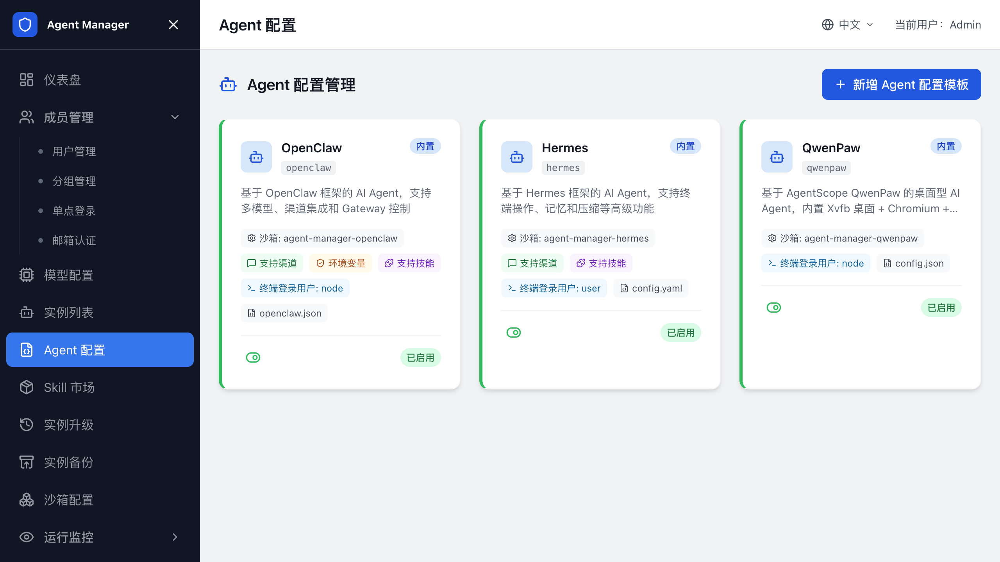
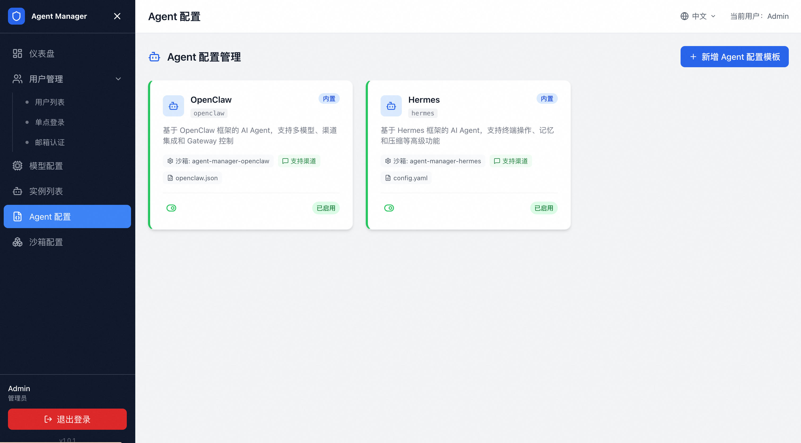

# 配置 Agent 类型

在 `Agent 配置` 中维护用户可选择的 Agent 类型、配置模板、自定义变量、渠道模板和备份升级命令。

SandboxSet 和沙箱镜像配置见 [配置沙箱（SandboxSet）](配置SandboxSet.md)。

## Agent 类型

用户创建实例时会先选择 Agent 类型。Agent 类型决定实例使用哪个配置模板、写入哪个配置文件、关联哪个 SandboxSet、用哪个用户启动，以及如何修改模型和渠道。

通过计算巢部署的新环境默认包含以下内置类型：

| 类型 | 代码 | 配置格式 | 关联 SandboxSet | 说明 |
| --- | --- | --- | --- | --- |
| OpenClaw | `openclaw` | JSON | `agent-manager-openclaw` | 基于 OpenClaw 框架的 AI Agent，内置多渠道集成能力。 |
| Hermes | `hermes` | YAML | `agent-manager-hermes` | Hermes Agent 运行环境。 |

不同版本可能包含更多内置类型，例如 QwenPaw。请以管理后台实际展示为准。

## 查看 Agent 配置

1. 登录管理后台。
2. 打开 `Agent 配置`。
3. 在列表中选择目标 Agent 类型。
4. 查看基本配置、配置模板、渠道模板和命令脚本。

内置类型通常可直接用于创建实例。需要调整内置类型时，先复制一份用于测试。

## 配置模板

配置模板用于生成每个实例的 Agent 配置文件。

模板支持占位符。用户创建实例或管理员保存配置时，系统会把模型、渠道和自定义变量写入模板。

常见占位符包括：

| 占位符 | 来源 |
| --- | --- |
| `${DASHSCOPE_API_KEY}` | 百炼 API Key。 |
| `${AI_GATEWAY_DOMAIN}` | 阿里云 AI 网关域名。 |
| `${CONSUMER_API_KEY}` | AI 网关为用户分配的消费者 Key。 |
| `${LITELLM_PROXY_URL}` | LiteLLM Proxy 地址。 |
| `${LITELLM_API_KEY}` | LiteLLM 为用户分配的 Key。 |
| `${CUSTOM_VAR}` | 管理员定义的自定义变量。 |

新增模型提供商时，`apiKeyPlaceholder` 和 `domainPlaceholder` 必须与模板和命令脚本中的占位符名称完全一致。名称不一致会导致模型调用失败。

## 配置写入路径和沙箱用户

Agent 类型需要声明配置文件写入位置和沙箱用户。

常见示例：

| 类型 | 配置写入路径 | 沙箱用户 |
| --- | --- | --- |
| OpenClaw | `/home/node/.openclaw/openclaw.json` | `node` |
| Hermes | `/opt/data/config.yaml` | 以实际镜像配置为准 |

沙箱用户必须与 SandboxSet 镜像中的实际运行用户一致。用户不一致时，平台可能无法写入配置文件，实例会启动失败。

## 自定义变量

自定义变量用于把每个实例不同的业务参数传入 Agent，例如项目 Token、Webhook 地址、外部服务 API Key 或系统提示词。

在 Agent 配置的自定义变量区域定义字段。用户创建实例时，页面会按定义展示输入框。

### 字段说明

| 字段 | 说明 |
| --- | --- |
| 变量名 | 模板和命令脚本中引用的占位符名称。 |
| 显示标签 | 创建实例表单中展示给用户的字段名称。 |
| 类型 | 文本、密码或多行文本等。 |
| 必填 | 开启后，用户创建实例时必须填写。 |
| 默认值 | 可选，未填写时使用默认值。 |
| 说明 | 展示给用户的填写提示。 |

自定义变量仅在创建实例时填写。创建后暂不支持用户在实例详情页直接修改。

## 渠道模板

支持渠道的 Agent 类型维护渠道模板。渠道模板定义用户创建实例时需要填写的 IM 或会话接入参数，例如飞书、钉钉、企业微信、QQ 的应用 ID、密钥、Webhook 或 Token。

配置渠道模板时确认：

- 字段名和 Agent 配置模板中的占位符一致。
- 密钥类字段使用密码类型，避免在页面和日志中明文展示。
- 渠道模板只描述该 Agent 类型支持的渠道，不要把不同 Agent 类型的私有字段混用。

用户创建实例并选择渠道后，页面会按渠道模板展示填写表单，并把填写结果写入实例配置。

## 升级配置入口

Agent 类型详情页包含 `备份&升级配置` 标签页，用于保存升级前备份命令、升级后恢复命令和命令超时时间。

发起 Agent 升级时，平台会读取这些配置并应用到目标 Sandbox。

这部分配置只定义“如何在升级过程中备份和恢复该 Agent 类型的数据”。实例备份操作见 [Agent 备份](Agent备份.md)；实际选择 Sandbox、发起升级、查看历史和处理失败任务，见 [Agent 升级](Agent升级.md)。

## 新增 Agent 类型

新增 Agent 类型有两种方式：复制现有类型，或自定义创建。

### 从模板复制

1. 打开 `Agent 配置`。
2. 单击新增 Agent 类型。
3. 选择从模板复制。
4. 选择一个现有类型，例如 OpenClaw。
5. 修改名称、代码、模板、命令或渠道配置。
6. 保存。

这种方式适用于基于内置类型做少量调整。

### 自定义创建

1. 准备 Agent 镜像。
2. 准备 SandboxSet YAML。
3. 在 `沙箱配置` 中创建 SandboxSet。
4. 在 `Agent 配置` 中创建 Agent 类型。
5. 关联对应 SandboxSet。
6. 填写配置写入路径、沙箱用户和启动命令。
7. 保存后创建测试实例验证。

## 相关文档

- [返回文档首页](index.md)
- [配置沙箱（SandboxSet）](配置SandboxSet.md)
- [技能管理](技能管理.md)
- [Agent 备份](Agent备份.md)
- [Agent 升级](Agent升级.md)
- [创建和管理 Agent 实例](创建和管理Agent实例.md)
- [配置网关](配置网关.md)
- [Agent Manager 常见问题与排障](常见问题与排障.md)
