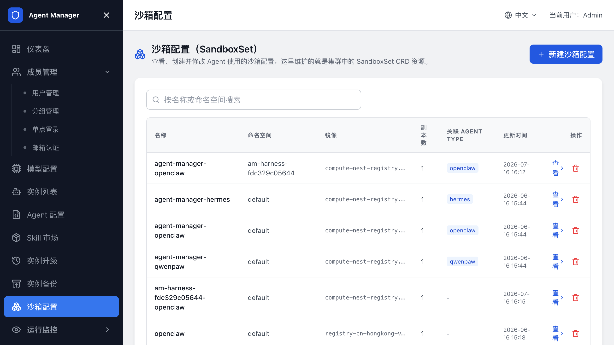
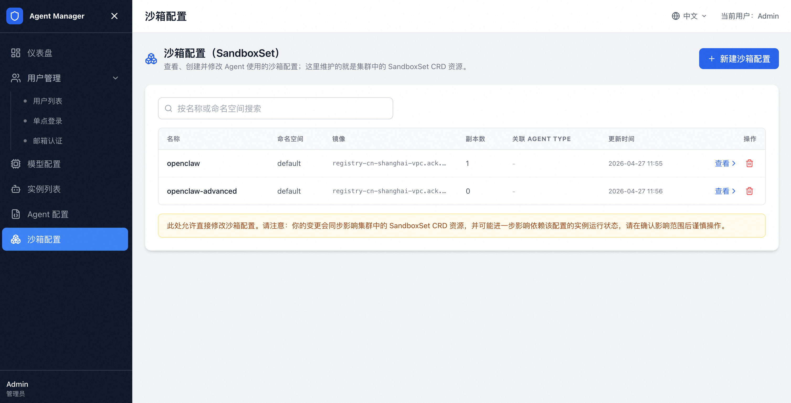

# 配置沙箱（SandboxSet）

在 `沙箱配置` 中管理 Agent 实例的运行环境，包括 SandboxSet、沙箱镜像、资源规格、命名空间和网络策略。SandboxSet 是创建 Agent 实例时使用的沙箱模板。



## SandboxSet

每个 SandboxSet 对应一类沙箱模板，决定实例使用的镜像、资源规格、副本数、端口、挂载卷和其他运行参数。

通过计算巢部署的新环境会为内置 Agent 类型创建对应 SandboxSet，例如 `agent-manager-openclaw` 和 `agent-manager-hermes`。

不同版本可能包含更多内置模板，以管理后台实际展示为准。

## 查看 SandboxSet

1. 登录管理后台。
2. 打开 `沙箱配置`。
3. 查看当前集群中的 SandboxSet 列表。
4. 单击查看进入详情页。

列表展示名称、命名空间、副本数、状态和操作入口。详情页提供 YAML 编辑器，用于查看和修改 SandboxSet 资源。



## 新建 SandboxSet

新增自定义 Agent 类型前，先准备对应 SandboxSet。

1. 打开 `沙箱配置`。
2. 单击新建沙箱配置。
3. 填写名称，例如 `agent-manager-<code>`。
4. 粘贴 SandboxSet YAML。
5. 保存。
6. 在 Agent 类型中关联该 SandboxSet。

保存后，先创建测试 Agent 类型和测试实例，确认沙箱能正常启动、写入配置、访问模型网关和打开应用访问链接。

## 修改 SandboxSet

修改 SandboxSet 后，新建或重建的沙箱会使用新配置。已运行实例通常不会自动应用新配置。

1. 打开 SandboxSet 详情页。
2. 在 YAML 编辑器中修改镜像、资源、环境变量或挂载配置。
3. 保存配置。
4. 停止并重新启动相关实例，或通过 [Agent 升级](Agent升级.md) 发起沙箱升级。
5. 创建或打开测试实例验证。

修改环境变量、镜像或挂载后，同步检查对应 Agent 类型的配置模板、启动命令和备份恢复命令。

## 沙箱镜像规范

自定义沙箱镜像需要满足以下要求：

| 要求 | 说明 |
| --- | --- |
| 基于可维护的 Agent 运行时镜像 | 避免从极简镜像开始构建。 |
| 内置进程管理 | 使用 supervisor、脚本或等效方式保证 Agent 进程可启动和重启。 |
| 提供健康检查端口 | 便于 SandboxSet 和平台判断实例状态。 |
| 固定配置文件路径 | 与 Agent 类型中的配置写入路径一致。 |
| 使用明确的运行用户 | 与 Agent 类型中的沙箱用户一致。 |
| 不在镜像中写死密钥 | 密钥通过模板变量写入。 |

修改镜像后，先用测试 Agent 类型和测试实例验证，再开放给用户。

## 备份恢复能力要求

如果要对已运行 Agent 实例执行备份或升级，SandboxSet 必须支持 `/backup` 挂载；要执行沙箱升级，还需要配置升级生命周期命令。

确认以下条件：

- SandboxSet 中存在 `agent-runtime` runtime。
- SandboxSet 中存在 `csi` runtime。
- 新建实例时已写入备份挂载信息。
- Agent 类型已配置升级前备份命令和升级后恢复命令。

旧实例如果创建时没有备份挂载信息，后续修复 SandboxSet 也不会自动补齐。重建实例，或由管理员手动补齐挂载能力后再升级。

## 在自定义 namespace 部署沙箱

把沙箱部署到非默认 namespace 前，确认 Agent Manager 后端 ServiceAccount 对目标 namespace 有访问 SandboxSet 和 Pod 的权限。

处理步骤：

1. 创建目标 namespace。
2. 在 SandboxSet YAML 中修改 `metadata.namespace`。
3. 替换安全组、交换机和镜像参数。
4. 提交 SandboxSet。
5. 在 Agent 类型中选择该 SandboxSet。
6. 创建测试实例验证。

如果目标 namespace 没有对应 RBAC 权限，实例创建、沙箱列表和 Agent 备份升级都可能失败。

## GlobalTrafficPolicy 网络策略

集群启用 `GlobalTrafficPolicy` 时，资源会通过 `spec.selector.matchLabels` 选中 Pod 并应用网络隔离规则。确认 selector 能匹配 Agent Pod 的 label；新增 Agent 类型或修改 SandboxSet 标签后，需要重新检查。

当新增工作负载或修改 SandboxSet label 后，需要检查：

```bash
kubectl edit globaltrafficpolicy openclaw-global-policy
```

如果策略 selector 未命中目标 Pod，网络隔离规则不会对新 Agent Pod 生效。

例如，策略需要匹配 OpenClaw Pod 时：

```yaml
spec:
  selector:
    matchLabels:
      app: agent-manager-openclaw
```

相同网络规则可以扩展现有策略的 selector；不同网络规则应新建独立的 `GlobalTrafficPolicy`。修改后验证平台、Agent Gateway 和 Sandbox 之间的必要链路仍然可达。

完整概念和配置方式请参考[阿里云 TrafficPolicy 文档](https://help.aliyun.com/zh/cs/user-guide/use-trafficpolicy-to-manage-agent-network-access-1)。

## 相关文档

- [返回文档首页](index.md)
- [配置 Agent 类型](配置Agent类型.md)
- [Agent 备份](Agent备份.md)
- [Agent 升级](Agent升级.md)
- [创建和管理 Agent 实例](创建和管理Agent实例.md)
- [Agent Manager 常见问题与排障](常见问题与排障.md)
