# 配置网关

本页介绍模型配置和网关接入。先在 `模型配置` 中添加模型提供商和模型条目；需要统一审计、统计和限流时，再配置阿里云 AI 网关或 LiteLLM。

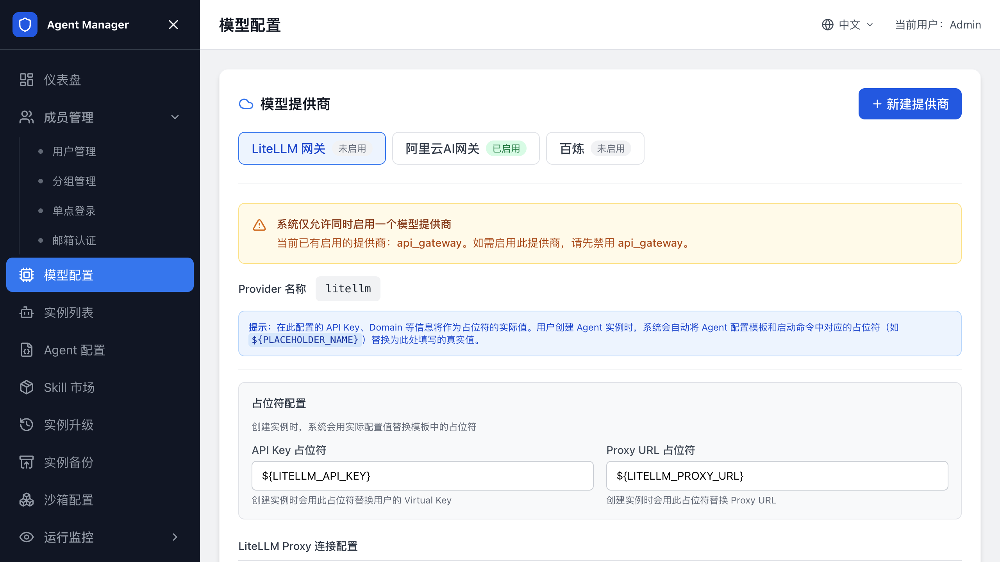

## 模型配置

用户创建实例时只能选择已启用模型。您需要先在 `模型配置` 页面准备这些模型。

模型由提供商和模型条目组成。提供商决定 API 地址、密钥占位符和调用方式；模型条目决定用户在创建实例时看到的模型名称和模型代码。

## 提供商分类

常见提供商包括：

| 类型 | 适用场景 |
| --- | --- |
| 阿里云百炼标准 API | 直接使用 DashScope OpenAI 兼容接口。 |
| 阿里云 AI 网关 | 通过网关统一代理模型调用，并为用户分配消费者凭证。 |
| LiteLLM | 通过 LiteLLM Proxy 统一接入多家模型。 |
| 自定义 OpenAI 兼容服务 | 接入其他兼容 OpenAI API 的模型服务。 |

## 配置阿里云百炼标准 API

1. 打开管理后台。
2. 进入 `模型配置`。
3. 添加或编辑百炼提供商。
4. 在 API Key 中填写百炼 API Key。
5. 保存提供商。
6. 添加模型，填写模型名称和模型代码。
7. 确认模型状态为已启用。

常见百炼 base URL：

```text
https://dashscope.aliyuncs.com/compatible-mode/v1
```

## 配置阿里云 AI 网关

按用户或分组统计 Token、设置预算或审计模型调用时，使用 AI 网关类提供商。

用户创建 Agent 实例时，系统会为用户分配独立消费者和访问凭证。

### 部署时自动创建

在计算巢部署时，将 `是否配置 AI 网关` 设为 `是`，填写 DashScope API Key、AI 网关规格和网络访问类型。部署完成后，平台启动时会自动获取网关信息并默认启用。

### 部署后手动配置

1. 访问阿里云 AI 网关控制台。
2. 创建网关实例。
3. 创建 HTTP API。
4. 配置模型代理和百炼 API Key。
5. 在 Agent Manager 管理后台打开 `阿里云 AI 网关`。
6. 填写网关 ID、域名、环境 ID、Consumer 配置和必要 AccessKey。
7. 保存并启用。

生产环境开启私网访问，让 Sandbox Pod 通过 VPC 内网访问网关。公网访问可用于调试或对外访问，但会产生公网流量费用。

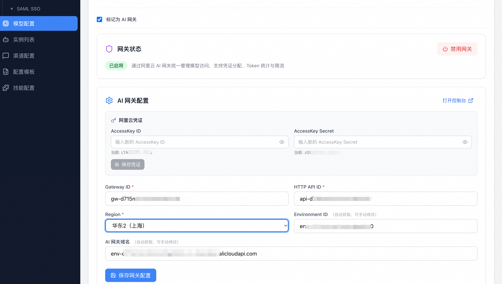

### 在阿里云 AI 网关控制台创建 API

如果选择部署后手动配置 AI 网关，按以下顺序在阿里云控制台完成 API、域名和消费者认证配置：

1. 打开 AI 网关实例，进入 `API`，单击创建 Model API。

   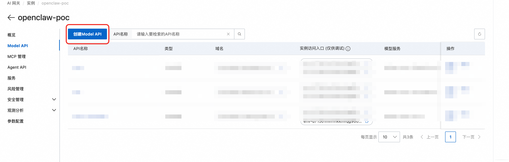

2. 选择百炼文本生成模型代理等场景模板。

   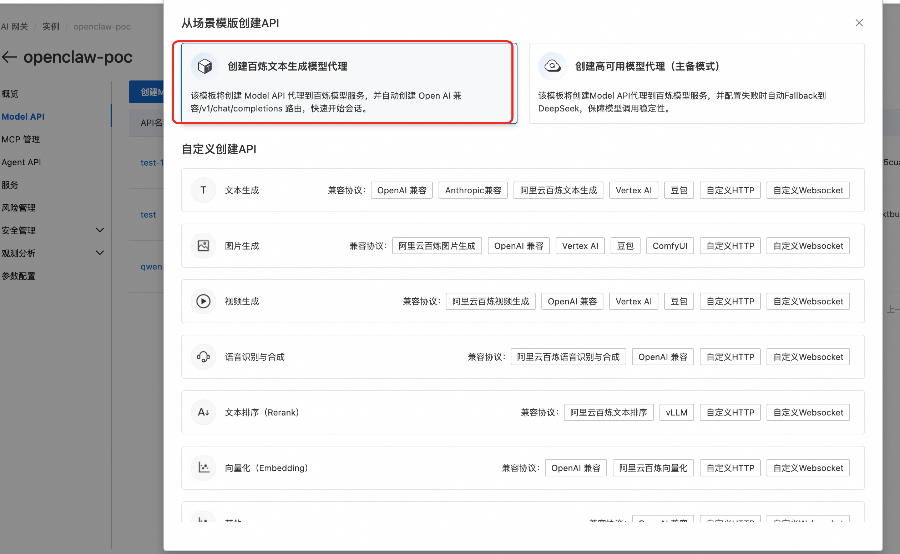

3. 填写 API 名称和 API Key。

   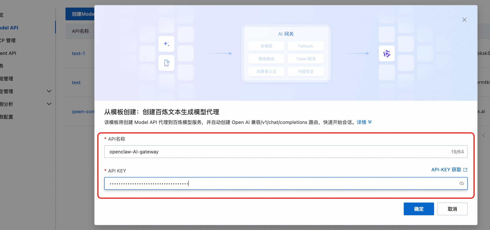

4. 在消费者认证中开启认证，并选择 API Key 等认证方式。

   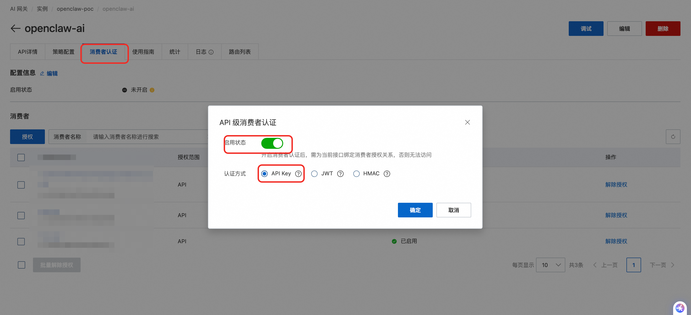

5. 创建网关域名，并将域名、Gateway ID、HTTP API ID 和环境 ID 填入 Agent Manager 的 AI 网关配置。

   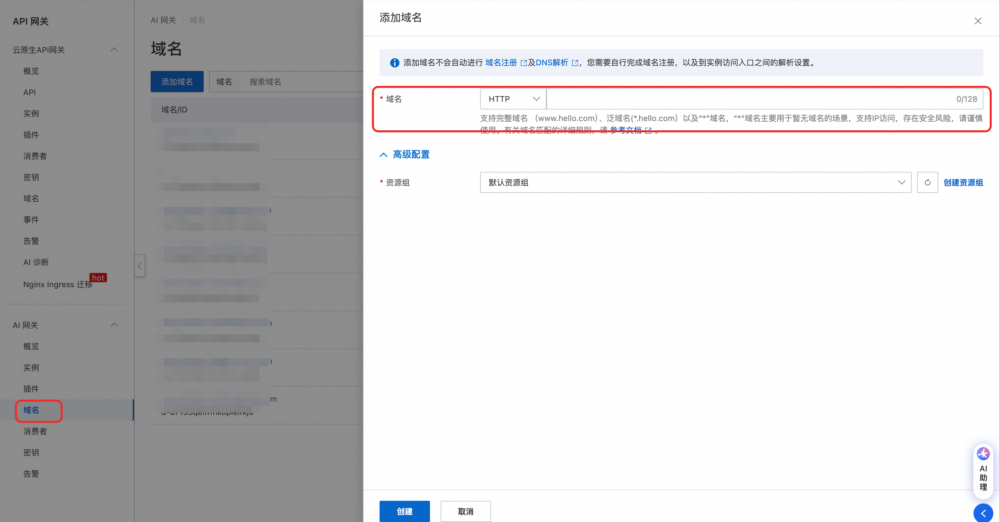

6. 在 Model API 中选择已创建的域名，确认 API 通过目标域名访问。

   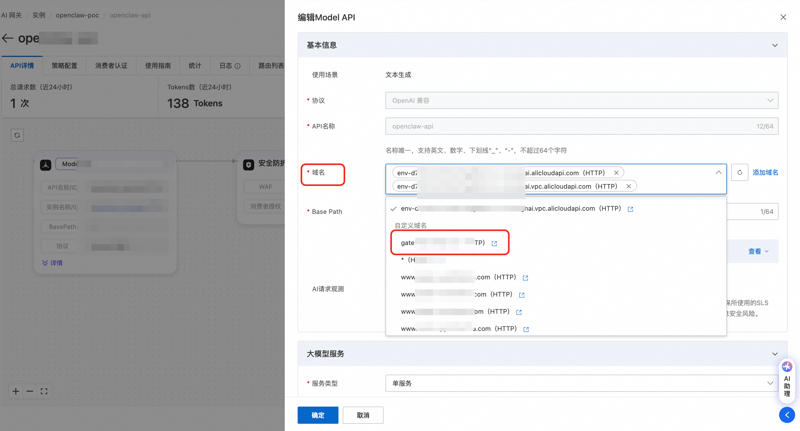

## 配置 LiteLLM

LiteLLM Proxy 支持将多家模型以统一的 OpenAI 兼容接口输出。平台调用 LiteLLM 管理接口，为用户自动创建用户和 Key。

1. 部署或准备 LiteLLM Proxy。
2. 获取 Proxy URL。
3. 获取 Master Key。
4. 在 Agent Manager 中新增 LiteLLM 提供商。
5. 填写 Proxy URL 和 Master Key。
6. 保存提供商。
7. 添加模型并启用。

用户创建实例时，系统会把 `${LITELLM_API_KEY}` 和 `${LITELLM_PROXY_URL}` 写入 Agent 配置模板。

## 新增模型提供商

1. 打开 `模型配置`。
2. 单击新增提供商。
3. 填写提供商名称、类型、Base URL、API Key 或管理密钥。
4. 填写占位符名称。
5. 保存。

占位符名称必须与 Agent 配置模板和启动命令中的变量名完全一致。比如模板中使用 `${DASHSCOPE_API_KEY}`，提供商就必须使用同名占位符。

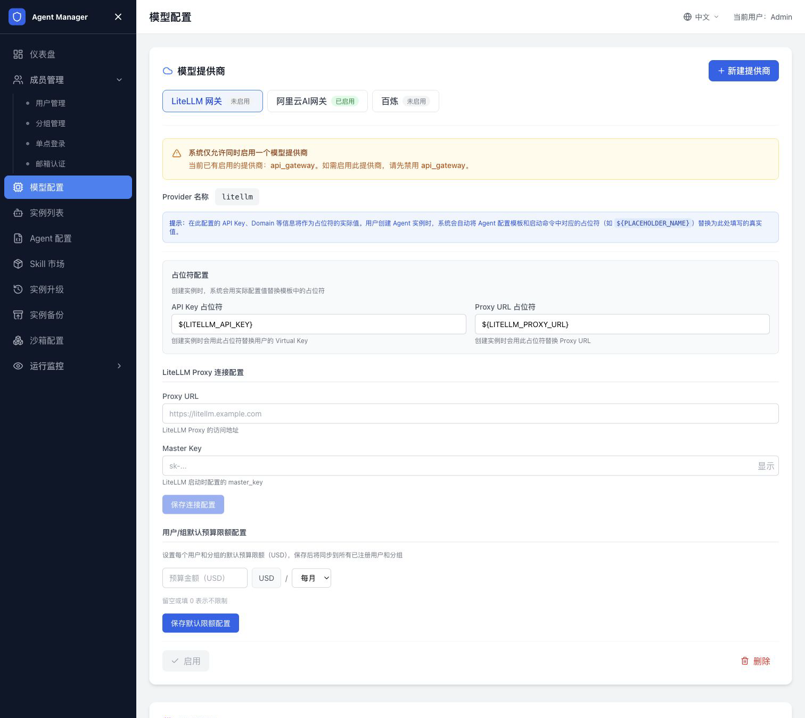

## 添加模型

1. 打开目标提供商。
2. 单击添加模型。
3. 填写模型名称。
4. 填写模型代码，例如 `qwen-plus`。
5. 保存。
6. 确认模型已启用。

用户创建实例时只能选择已启用模型。

## 编辑或删除模型

编辑模型会影响后续选择该模型的新实例。已经运行的实例不会自动切换模型，用户需要在实例详情页手动修改并保存。

删除模型前，确认没有业务仍依赖该模型。更稳妥的做法是先禁用模型，观察一段时间后再删除。

## Token 统计

Token 统计依赖 AI 网关和日志服务。启用后，管理员仪表盘和用户页面会展示 Token 使用情况。

常见指标包括：

| 指标 | 说明 |
| --- | --- |
| 今日 Token 用量 | 当天累计消耗。 |
| 近 30 天 Token 用量 | 近 30 天累计消耗。 |
| 用户 Token 排行 | 管理员查看高消耗用户。 |
| 个人用量概览 | 用户查看自己的用量和限额。 |

如果未启用 AI 网关，Token 统计相关指标不会显示。

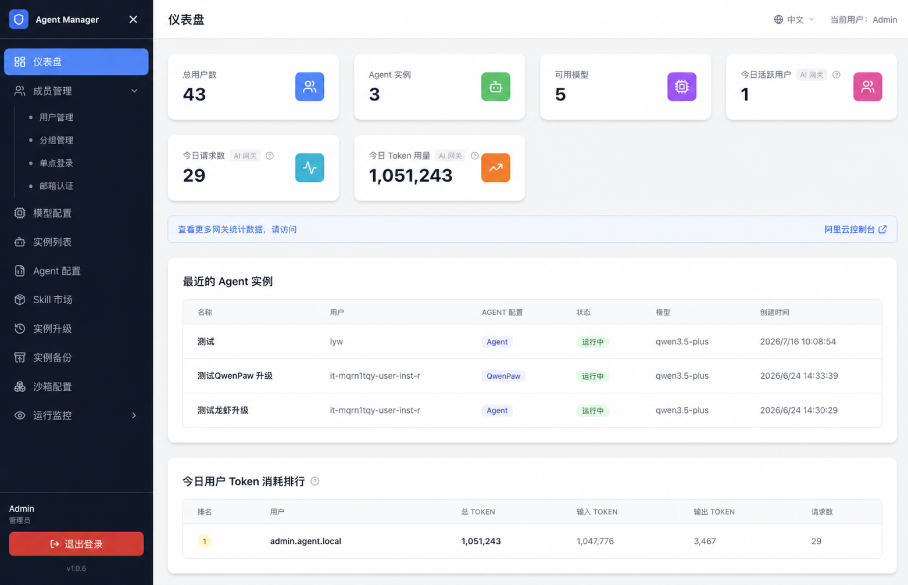

## 全局限流

全局限流用于设置所有用户默认 Token 上限。

1. 打开管理后台。
2. 进入 Token 统计与限流。
3. 设置每日 Token 上限。
4. 设置近 30 天 Token 上限。
5. 保存配置。

未设置个人限额的用户会继承全局限流策略。

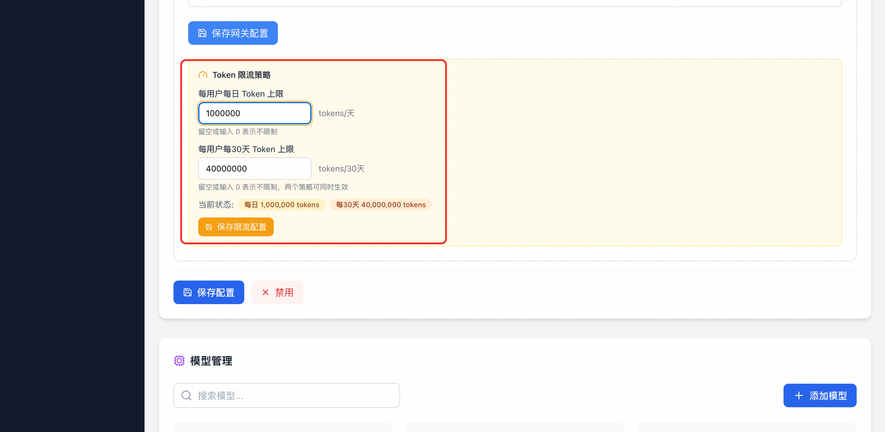

## 个人限流

个人限流用于覆盖某个用户的全局限额。

1. 打开用户管理。
2. 找到目标用户。
3. 打开限流配置。
4. 设置每日或近 30 天个人 Token 上限。
5. 保存。

设置个人限额后，该用户以个人限额为准。未设置的维度继续继承全局限额。

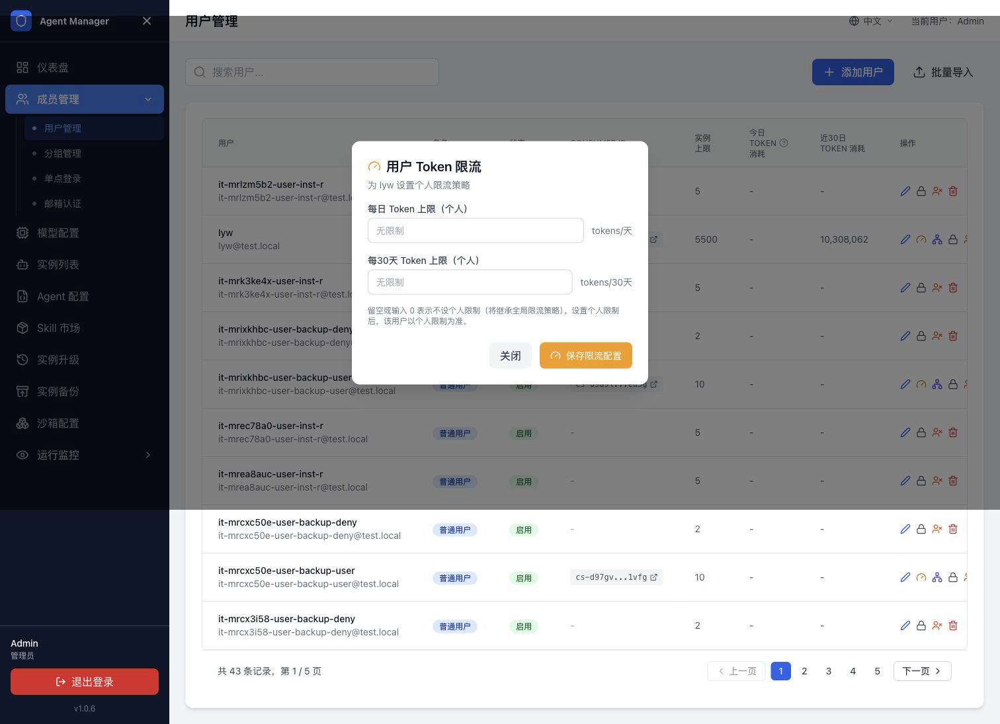

## 分组限流

分组限流用于给团队、项目或业务线设置独立的 Token 或预算上限。分组限流依赖已启用的 AI 网关或 LiteLLM，并要求分组已经具备可用的消费者凭证。

1. 打开管理后台。
2. 进入 `分组管理`。
3. 找到目标分组。
4. 打开限流配置。
5. 设置每日或近 30 天限额。
6. 保存配置。

设置分组限额后，以该分组创建的实例会按分组消费者统计用量。未设置分组限额的维度继续继承全局策略。

## AI 网关启用后的效果

启用 AI 网关后：

- 用户创建 Agent 实例时，系统自动创建对应消费者和凭证。
- Agent 配置模板会写入消费者 API Key 和网关域名。
- 管理员查看用户和分组 Token 用量排行。
- 管理员设置全局、个人和分组 Token 限额。

## 相关文档

- [返回文档首页](index.md)
- [创建和管理 Agent 实例](创建和管理Agent实例.md)
- [配置 Agent 类型](配置Agent类型.md)
- [用户、登录和分组管理](用户登录与分组管理.md)
- [Agent Manager 常见问题与排障](常见问题与排障.md)
